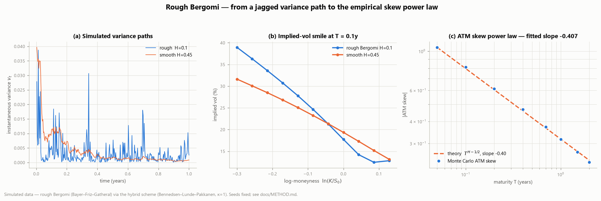
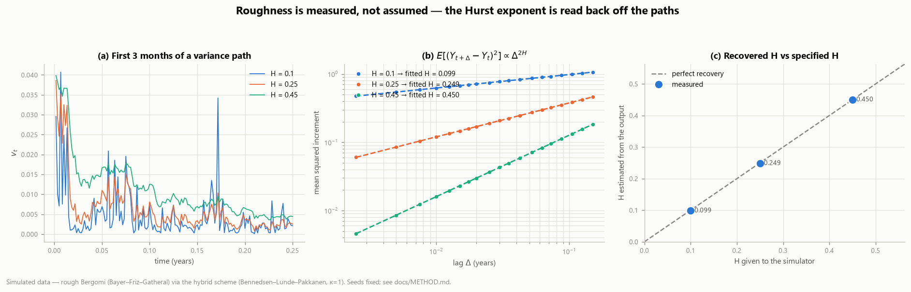
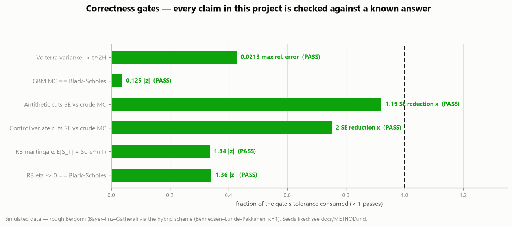
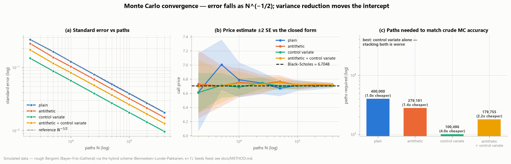
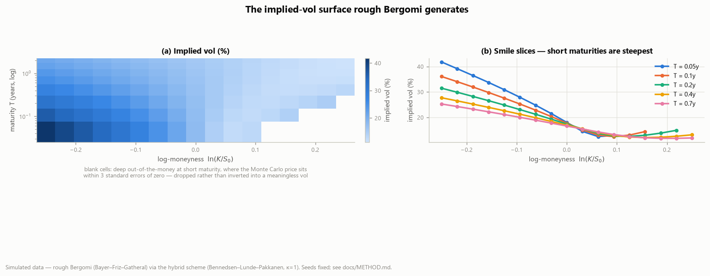
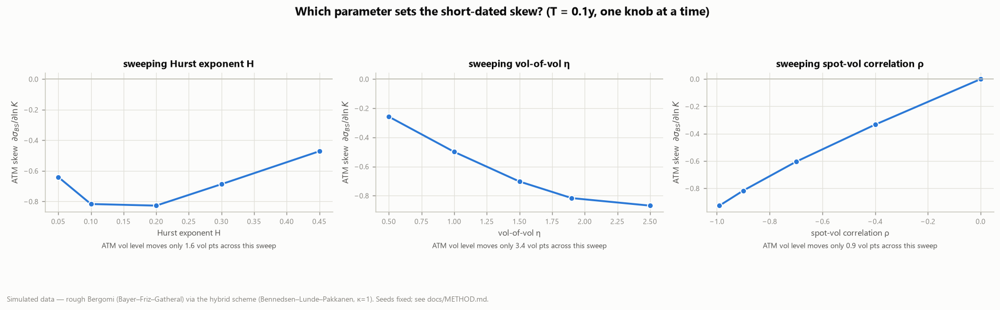

# Project 01 — Rough Volatility Monte Carlo


Monte Carlo methods, random-number generation, object-oriented modeling and
NumPy vectorization, applied to one of the most active topics in quantitative
finance: **rough stochastic volatility**.

> **The question.** Classical stochastic-volatility models structurally *cannot*
> reproduce the steep short-maturity implied-volatility skew that equity markets
> actually show. Rough volatility can — theory predicts the at-the-money skew
> decays as a power law `T^(H−1/2)`. Can a from-scratch Monte Carlo engine, built
> on nothing but NumPy and SciPy, recover that exponent?

**The answer: yes, to within Monte Carlo error.**

| | |
|---|---|
| Fitted ATM-skew power-law exponent | **−0.407** |
| Theoretical exponent `H − 1/2` (H = 0.10) | **−0.400** |
| Hurst exponent recovered from the simulated paths | **0.099** (specified: 0.100) |
| Validation gates passing | **6 / 6** |
| Unit tests passing | **25** |
| Runtime, 200k paths × 100 steps | **≈1.6 s** |

---

## Contents

1. [Headline result](#1-headline-result)
2. [Roughness is measured, not assumed](#2-roughness-is-measured-not-assumed)
3. [The engine is validated against known answers](#3-the-engine-is-validated-against-known-answers)
4. [Monte Carlo convergence — and a bug worth reading about](#4-monte-carlo-convergence--and-a-bug-worth-reading-about)
5. [The surface the model generates](#5-the-surface-the-model-generates)
6. [Which parameter controls the skew](#6-which-parameter-controls-the-skew)
7. [Data](#7-data) · [Repository layout](#8-repository-layout) · [Running it](#9-running-it)
10. [What I'd do next](#10-what-id-do-next) · [Honest limitations](#11-honest-limitations) · [References](#12-references)

---

## 1. Headline result



**(a)** A rough (`H = 0.1`) variance path is visibly jagged next to a smoother
(`H = 0.45`) one — same model, same vol-of-vol, only the Hurst exponent differs.
**(b)** At a 0.1-year maturity the rough model generates a markedly steeper
implied-vol skew; Black–Scholes is flat here by construction. **(c)** The
at-the-money skew across maturities lies on the `T^(H−1/2)` line over more than
a decade of maturity, from 0.05 to 2 years.

Fitting `log|skew|` on `log T` gives a slope of **−0.407** against a theoretical
**−0.400**.

<details>
<summary>The model, in one block</summary>

$$v_t = \xi_0 \exp\left(\eta Y_t - \tfrac{1}{2}\eta^2 t^{2H}\right), \qquad
\frac{dS_t}{S_t} = r\,dt + \sqrt{v_t}\,dZ_t, \qquad dZ = \rho\,dW + \sqrt{1-\rho^2}\,dW^{\perp}$$

`Y` is the normalized Riemann–Liouville fractional process with
`Var(Y_t) = t^{2H}`, driven by the same Brownian motion as the price. Full
derivation and the discretization scheme: [`docs/METHOD.md`](docs/METHOD.md).
</details>

## 2. Roughness is measured, not assumed

Telling a simulator that `H = 0.1` proves nothing. This figure reads the Hurst
exponent **back out of the generated paths** and checks it against what went in.



For a process with `Var(Y_t) = t^{2H}`, the mean squared increment scales as
`E[(Y_{t+Δ} − Y_t)²] ∝ Δ^{2H}`, so a log-log regression on the lag has slope
`2H`. Across three very different regimes the recovery is essentially exact:

| specified `H` | recovered from the paths | error |
|---|---|---|
| 0.10 | **0.0986** | −0.0014 |
| 0.25 | **0.2487** | −0.0013 |
| 0.45 | **0.4503** | +0.0003 |

This is the check that says the hybrid scheme is implemented correctly, and it
is independent of anything to do with option pricing.

## 3. The engine is validated against known answers



Six gates, each comparing a simulated quantity against something known
independently — a closed form, an exact moment, or a theoretical scaling law.
`scripts/validate.py` exits non-zero if any fails, which is what makes it usable
in CI.

| # | Gate | Checks | Result | Tolerance |
|---|---|---|---|---|
| 1 | `Var(Y_t) → t^{2H}` | the hybrid scheme itself | max rel. err **2.1%** | < 5% |
| 2 | GBM Monte Carlo == Black–Scholes | the pricer | **\|z\| = 0.13** | < 3.5 |
| 3 | Antithetic sampling cuts the SE | efficiency | **1.19×** | > 1.1 |
| 4 | Control variate cuts the SE | efficiency | **2.00×** | > 1.5 |
| 5 | `E[S_T] = S₀e^{rT}` | risk-neutral drift / martingale | **\|z\| = 1.34** | < 4 |
| 6 | `η → 0` collapses to Black–Scholes | the model's flat-vol limit | **\|z\| = 1.36** | < 4 |

Underneath these sit **25 fast unit tests** (`pytest -q`) covering put–call
parity, implied-vol round-trips, no-arbitrage bounds, positivity of the variance
process, `E[v_t] = ξ₀`, the antithetic pairing structure, and seed determinism.

## 4. Monte Carlo convergence — and a bug worth reading about



All estimators fall as `N^(−1/2)`, as they must; variance reduction moves the
intercept, not the slope. Panel (c) converts that into the number that actually
matters — paths needed for a target accuracy.

**Two things this project got wrong first.** Both are documented rather than
quietly fixed, because they are the interesting part:

**(a) The antithetic standard error was being computed incorrectly.** The first
version reported `std(all draws)/√N`. But antithetic samples are *deliberately
dependent* — that negative correlation is the entire mechanism — so treating
them as independent measures the crude-Monte-Carlo error no matter how much
variance the pairing actually removed. The symptom: antithetic sampling appeared
to do **nothing**, identical standard errors to four significant figures. The
correct estimator has `N/2` independent observations, each the average of one
antithetic pair. The price estimate was never wrong; the *error bar* was.
Pinned by `test_standard_error_uses_antithetic_pairs`.

**(b) Stacking both techniques is worse than using one.** With the standard
error fixed, on a 1-year 105-strike call at 400,000 paths:

| estimator | standard error | vs crude MC |
|---|---|---|
| crude Monte Carlo | 0.01931 | 1.00× |
| antithetic only | 0.01613 | 1.20× |
| **control variate only** | **0.00968** | **2.00×** |
| antithetic + control variate | 0.01294 | 1.49× |

The combination is *worse than the control variate alone* — and the reason is
structural. The control variate removes the component of the payoff that is
linear in `S_T`, which is precisely the odd-in-`z` component antithetic sampling
exists to cancel. What survives the regression is close to an **even** function
of `z`, and for an even function an antithetic pair is *positively* correlated,
so pairing adds variance back.

## 5. The surface the model generates



The full `(maturity × log-moneyness)` surface. The short end is dramatically
steeper than the long end — that steepening *is* the rough-volatility signature,
and it is what a diffusive model cannot produce.

Blank cells are honest gaps: deep out-of-the-money at short maturity, the Monte
Carlo price falls within 3 standard errors of zero, and inverting such a price
would yield a meaningless implied vol. They are dropped rather than interpolated.

## 6. Which parameter controls the skew



Sweeping one parameter at a time at `T = 0.1y`:

- **`ρ` is the primary skew driver** — the skew scales almost linearly with the
  spot/vol correlation and vanishes at `ρ = 0`, as it must.
- **`η` (vol-of-vol) steepens the skew** monotonically.
- **`H` is non-monotone over this range** and is the parameter that controls how
  the skew *decays with maturity* rather than its level at any single maturity —
  which is exactly why the headline test is a term structure, not a point.

Critically, the ATM volatility **level** moves by only 0.9–3.4 vol points across
each sweep. The parameters that set the skew barely touch the level, which is
what makes the model calibratable in practice.

## 7. Data

**This project consumes no external dataset** — everything is generated from a
specified model with fixed seeds. That is what makes every result checkable
against a closed form.

The generated data is documented to the same standard an external dataset would
get: the process, the parameter table, every seed and path count, the committed
artifacts, and the known limitations. See **[`data/README.md`](data/README.md)**.

## 8. Repository layout

```
src/roughvol/
  black_scholes.py  closed-form BS price + implied-vol inversion (Brent)
  models.py         GBM and RoughBergomi (hybrid-scheme simulator), OOP
  mc_pricer.py      European pricing, antithetic + control-variate reduction
  smile.py          implied-vol smiles and the ATM-skew term structure
  analysis.py       roughness estimation, convergence, surfaces, gates
  plotting.py       the six report figures
  style.py          shared theme + colorblind-validated palette
scripts/
  validate.py       6 correctness gates — run this first
  run_experiment.py the headline result
  make_figures.py   the full figure set
tests/
  test_roughvol.py  25 unit tests
docs/METHOD.md      the maths: model, scheme, derivations, references
data/README.md      simulated-data card (parameters, seeds, limitations)
reports/            generated figures and tables
```

## 9. Running it

```bash
pip install -r requirements.txt

python scripts/validate.py         # 6/6 gates      (~15 s)
python scripts/run_experiment.py   # headline result (~40 s)
python scripts/make_figures.py     # full figure set (~55 s)
pytest -q                          # 25 unit tests   (~7 s)
```

`make_figures.py --quick` runs the same pipeline at lower path counts.
Timings are single-core laptop CPU; peak memory stays under 1 GB.

### Which script produces which figure

| Output | Produced by |
|---|---|
| `reports/rough_vol_results.png` | `run_experiment.py` |
| `reports/figures/02_roughness.png` | `make_figures.py` step 1 |
| `reports/figures/03_convergence.png` | `make_figures.py` step 2 |
| `reports/figures/04_vol_surface.png` | `make_figures.py` step 3 |
| `reports/figures/05_parameter_sensitivity.png` | `make_figures.py` step 4 |
| `reports/figures/06_validation.png` | `make_figures.py` step 5 |
| `reports/tables/*.csv` | `make_figures.py` (all steps) |

## 10. What I'd do next

- **Calibrate to a real surface** (SPX options) instead of using illustrative
  parameters, and report the calibration error rather than a structural check.
- **A term structure of forward variance** — `ξ₀` is currently a constant; real
  markets have a curve.
- **Markovian approximations** (Bayer & Breneis 2023) to replace brute-force
  Monte Carlo with a low-dimensional state-space model — orders of magnitude
  faster, and the direction the field actually went.
- **Estimate `H` from market data** using the Cont–Das non-parametric estimator,
  which would engage directly with the "fact or artefact?" debate below.
- **Pricing beyond vanillas** — barriers and cliquets, where path-dependence
  makes roughness matter far more than it does for European options.

## 11. Honest limitations

- The fitted exponent `−0.407` vs `−0.400` is **not** a claim about markets. It
  says the simulator reproduces the model's own theoretical prediction. Whether
  real markets are rough is a separate and contested question (§12).
- Parameters are illustrative, not calibrated.
- The hybrid scheme is exact only on the singular cell; the far-field Riemann sum
  leaves an `O(Δt)` bias, bounded at ≈2% by gate 1 but not extrapolated away.
- Zero rates, no dividends, no jumps, flat forward variance.
- The skew term structure uses a single seed per maturity — the reported
  exponent has Monte Carlo uncertainty that is not error-barred.

## 12. References

**The model and the empirical claim**
- Gatheral, Jaisson & Rosenbaum (2018). *Volatility is rough.* Quantitative Finance 18(6).
- Bayer, Friz & Gatheral (2016). *Pricing under rough volatility.* Quantitative Finance 16(6).

**The scheme implemented here**
- Bennedsen, Lunde & Pakkanen (2017). *Hybrid scheme for Brownian semistationary processes.* Finance and Stochastics 21(4).
- McCrickerd & Pakkanen (2018). *Turbocharging Monte Carlo pricing for the rough Bergomi model.* Quantitative Finance 18(11).

**Where the field is now**
- Bayer, Friz, Gatheral, Gulisashvili, Horvath, Jacquier & Muguruza (2023). *Rough Volatility.* SIAM.
- Bayer & Breneis (2023). *Markovian approximations of stochastic Volterra equations with the fractional kernel.* Quantitative Finance 23(1).

**The case against — worth reading before believing the premise**
- Rogers (2019, rev. 2023). *Things we think we know.*
- **Cont & Das (2024). *Rough volatility: fact or artefact?* Sankhya B 86(1).** —
  shows that estimating `H` from *realized* volatility can yield `Ĥ ≈ 0.1` even
  when the underlying spot-volatility process is **not** rough, because the
  estimator picks up microstructure noise and the discretization of the
  realized-variance proxy rather than true path regularity.

This last one matters for how the project should be read. The critique is about
*estimating* `H` from market data; it does not affect what is demonstrated here,
which is that a rough Bergomi simulator generates the `T^(H−1/2)` skew law it is
claimed to generate. It does bear on the motivating premise that markets have
`H ≈ 0.1`. The honest summary: **the engine reproduces the theory it was built to
test; whether markets are genuinely rough remains open.**
