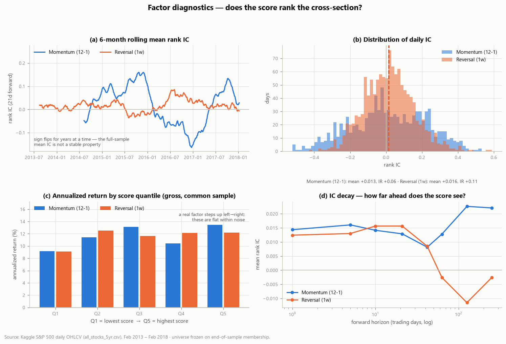
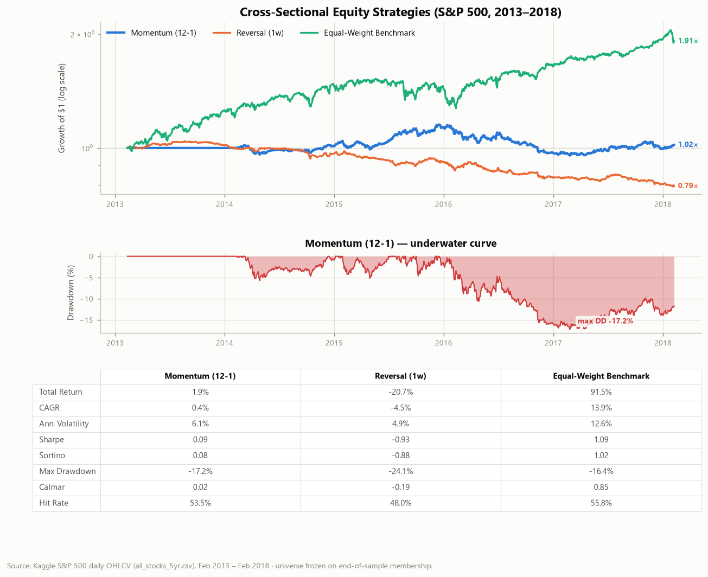
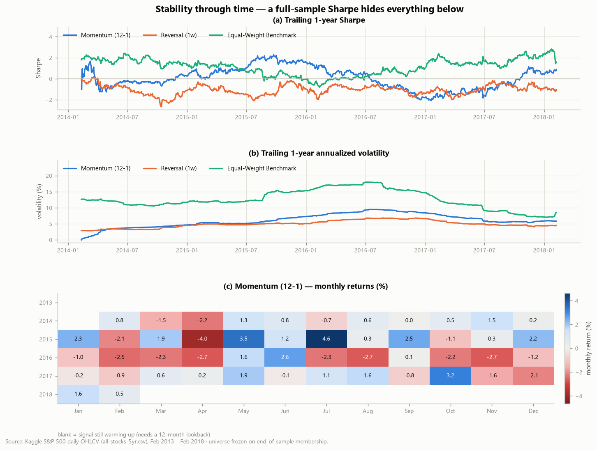
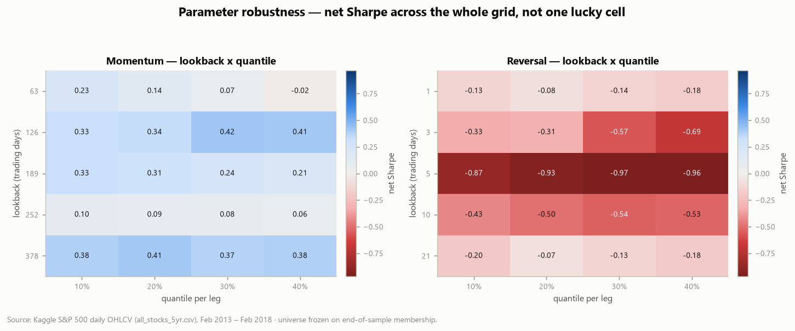
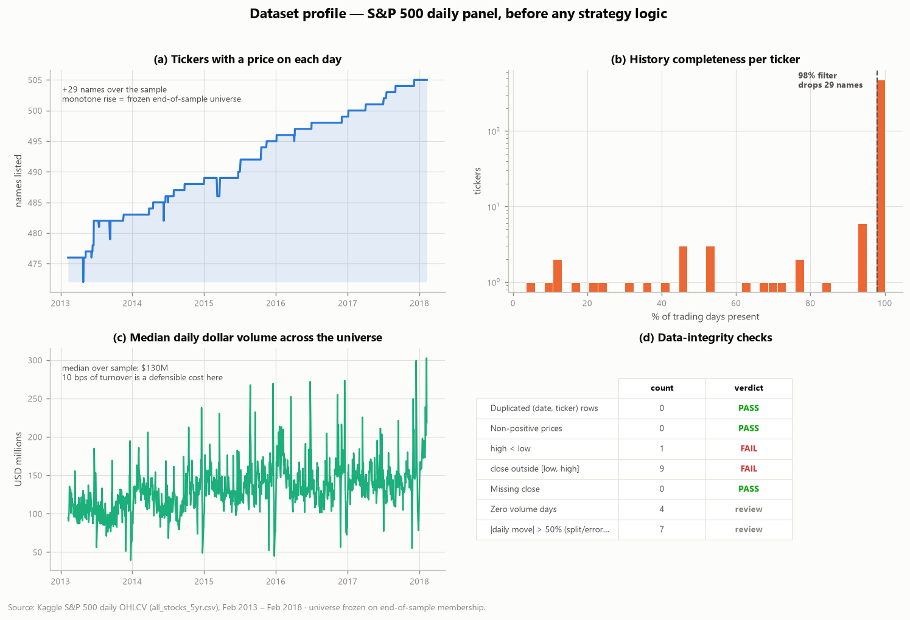
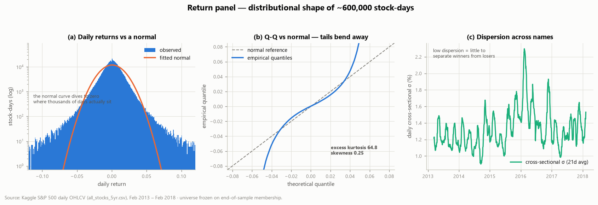

# Project 02 — Systematic Cross-Sectional Equity Backtest


pandas/NumPy data wrangling, feature construction and empirical model
evaluation, built as a quantitative-research workflow.

> **The question.** Do the two most famous cross-sectional equity factors — 12-1
> momentum and short-term reversal — actually generate risk-adjusted returns on
> the S&P 500 universe from 2013–2018, *after realistic trading costs*?

**The answer is mostly no, and the reasons why are the point of the project.**
A researcher's job is to tell a real edge from an artefact, so this write-up
spends more space on *why* the numbers come out the way they do than on the
numbers themselves.

| | Momentum (12-1) | Reversal (1w) | Equal-Weight Benchmark |
|---|---|---|---|
| **Net Sharpe** | **0.09** | **−0.93** | **1.09** |
| Gross Sharpe (before costs) | 0.16 | 0.71 | — |
| CAGR | 0.4% | −4.5% | 13.9% |
| Ann. volatility | 6.1% | 4.9% | 12.6% |
| Max drawdown | −17.2% | −24.1% | −16.4% |
| Avg one-way turnover | 46% / month | 157% / week | — |
| **Break-even cost** | **22.6 bps** | **4.3 bps** | — |

*Dollar-neutral long/short books (top/bottom quintile), 10 bps per unit of
one-way turnover, one-day execution lag.*

Three headline conclusions, each backed by a figure below:

1. **Reversal has a genuine gross edge that turnover destroys entirely.** Sharpe
   goes from **+0.71 gross to −0.93 net**. It needs execution below **4.3 bps**
   to break even — institutional-grade, and more than most desks achieve.
2. **The benchmark's Sharpe of 1.09 is not a fair comparison.** It is inflated by
   survivorship bias *measurable in this very dataset* and by 2013–2018 being an
   uninterrupted bull market.
3. **The headline momentum config happens to be one of the worst cells in its own
   parameter grid** — and saying so is more honest than quietly reporting the
   better ones. Details in §5.

---

## Contents

1. [Is the signal real? Diagnostics before backtests](#1-is-the-signal-real-diagnostics-before-backtests)
2. [The backtest](#2-the-backtest)
3. [Where the edge goes: transaction costs](#3-where-the-edge-goes-transaction-costs)
4. [Stability through time](#4-stability-through-time)
5. [Parameter robustness — including an inconvenient result](#5-parameter-robustness--including-an-inconvenient-result)
6. [The dataset, and what's wrong with it](#6-the-dataset-and-whats-wrong-with-it)
7. [What keeps the test honest](#7-what-keeps-the-test-honest)
8. [Repository layout](#8-repository-layout) · [Running it](#9-running-it)
10. [What I'd do next](#10-what-id-do-next) · [Limitations](#11-honest-limitations) · [References](#12-references)

---

## 1. Is the signal real? Diagnostics before backtests

An equity curve is one number's worth of evidence, and it confounds the signal
with the portfolio rules and the cost model stacked on top. So the signal gets
interrogated on its own first.



**(a) Rolling information coefficient.** The rank correlation between today's
score and next month's return flips sign for *years at a time*. Momentum's IC is
strongly positive through 2015 and strongly negative through 2016 — a full-sample
average conceals this completely.

**(b) IC distribution.** Both signals have a *positive mean* IC, but relative to
an enormous spread:

| | Mean IC | Std IC | **IC IR** | t-stat (naive) | % days positive |
|---|---|---|---|---|---|
| Momentum (12-1) | +0.0129 | 0.208 | **+0.062** | 1.95 | 51.2% |
| Reversal (1w) | +0.0157 | 0.138 | **+0.114** | 3.99 | 54.6% |

An IC information ratio of 0.06 is, for practical purposes, noise. (The t-stats
use overlapping 21-day forward windows, so the effective sample is far smaller
than the row count — they are reported as an upper bound, not a result.)

**(c) Quantile monotonicity.** A real factor makes this panel step up from Q1 to
Q5. Neither does: momentum runs 9.2% → 11.4% → 13.1% → 10.4% → 13.5%, which is
*noisy*, not monotone. Both signals are evaluated on the same common sample so
the bars are comparable.

**(d) IC decay.** Momentum's IC survives out to ~250 days; reversal's goes
negative beyond ~40 days. That decay profile is what dictates rebalancing
frequency, and therefore how much cost you pay — which is exactly where reversal
dies.

## 2. The backtest



## 3. Where the edge goes: transaction costs

This is the most important figure in the project.


**(a)** Reversal's *gross* curve (solid orange) ends up +18%; its *net* curve
(dashed) ends at −21%. **(b)** It pays away **38% of initial capital** in costs
over five years — nearly 8% a year. Momentum pays 2%. **(c)** The cause is
turnover: 157% per weekly rebalance, ~7,900% annualized, against momentum's 46%
monthly. **(d)** The break-even cost:

| | Break-even cost | At the assumed 10 bps |
|---|---|---|
| Momentum (12-1) | **22.6 bps** | survives, barely (Sharpe 0.09) |
| Reversal (1w) | **4.3 bps** | destroyed (Sharpe −0.93) |

Reversal is a textbook case of a real gross signal that is not a *strategy*.
It needs sub-5 bps execution to be worth trading at all.

## 4. Stability through time



A single full-sample Sharpe hides everything here. Momentum's trailing one-year
Sharpe ranges from roughly **+2 to −2** — the strategy is not "flat", it has
long alternating regimes that happen to average out. The monthly calendar shows
the same thing: 2015 was a good year, 2016 was uniformly bad.

## 5. Parameter robustness — including an inconvenient result



A single parameter pair looking good is not evidence; a *neighbourhood* looking
good is. So here is the whole grid, net of costs.

**And it says something awkward about my own headline number.** The 252-day /
20%-quantile momentum config reported at the top of this README scores **0.10** —
one of the *worst* cells in its grid. Most of the grid runs **0.2–0.4**, with
126-day and 378-day lookbacks reaching 0.42.

Two honest readings, and I think both are true:

- The headline configuration was chosen *a priori* from the literature (Jegadeesh
  & Titman's 12-1 definition), not selected after seeing results. It was not
  cherry-picked — if anything it was unlucky.
- Equally, the 0.42 cell **is not a discovery**. It is the best of 20 cells on a
  single five-year sample with no walk-forward validation. Reporting it as "the"
  result would be exactly the overfitting this figure exists to detect.

The defensible conclusion is the weak one: **momentum on this universe is
positive but small (Sharpe ≈ 0.1–0.4) and not reliably distinguishable from
zero.** Reversal is negative across the *entire* grid after costs — 20 out of 20
cells — which is a much more robust finding than any single number.

## 6. The dataset, and what's wrong with it

Every result above inherits the defects of the panel underneath it, so the panel
is audited before any strategy logic runs.



**619,040 rows · 505 tickers · 1,259 trading days · 2013-02-08 → 2018-02-07.**

**(a) is the survivorship-bias fingerprint.** The number of listed names rises
monotonically from 476 to 505 and **never falls**. No real index membership
behaves that way — firms get acquired, go bankrupt, get relegated. The universe
was frozen on *end-of-sample* membership, so every failure is missing. This is
why the equal-weight benchmark's 1.09 Sharpe is not a fair yardstick, and why the
market-neutral books, which are short the same biased universe they are long, are
far less exposed.

**(d) found real defects.** The integrity checks are code, not commentary:

| check | count | verdict |
|---|---|---|
| Duplicated (date, ticker) rows | 0 | ✅ PASS |
| Non-positive prices | 0 | ✅ PASS |
| `high < low` | 1 | ❌ **FAIL** |
| `close` outside `[low, high]` | 9 | ❌ **FAIL** |
| Single-day move > ±50% | 7 | ⚠️ review |

Twenty rows are defective in total — 9 with mutually inconsistent prices (AOS
trips both price checks) and 11 with a missing OHLC field.

Of the seven ±50% moves, **four are not returns at all** — they are corporate
actions the vendor never adjusted for (eBay's PayPal spin-off, NiSource's
Columbia Pipeline spin-off, and Discovery's 2-for-1 split across two share
classes). One more, a bad `close` of 17.87 for LNT on 2016-05-19 against a
session low of 35.09, manufactures the single largest "return" in the entire
panel (+100.9%) the following day.

These rows are **left in**. The strategies run on the data as distributed, which
is the honest baseline; quantifying the contamination is more useful than
silently patching seven rows and reporting a cleaner-looking number.



Excess kurtosis of **64.8** against a normal's 0. Every Sharpe ratio in this
project therefore understates tail risk — stated explicitly rather than left for
the reader to assume Gaussianity.

📄 **Full data card, with provenance, schema, checksums, every failing row, and
the bias inventory: [`data/README.md`](data/README.md).**

## 7. What keeps the test honest

Design choices that exist specifically to stop the backtest from lying, each one
covered by a test in `tests/test_quantbt.py`:

| Choice | Prevents |
|---|---|
| **One-day execution lag** — weights set at close of `t` act on `t+1` returns | look-ahead bias |
| **One-month skip** in the 12-1 momentum window | contamination by short-term reversal |
| **≥98% presence filter** (505 → 476 names) | mid-sample listings/delistings distorting the cross-section |
| **Costs charged on realized turnover**, not a flat haircut | flattering high-turnover strategies |
| **Signals evaluated on a common date range** | comparing books with different start dates |
| **Warm-up months shown blank**, not as 0.0% | advertising flat months the strategy never had |

The look-ahead guarantee is asserted directly rather than assumed:
`test_no_lookahead_future_returns_cannot_change_the_past` rewrites the *final*
day's returns and requires every earlier P&L value to be bit-identical.

**30 tests pass** (`pytest -q`), covering metrics against closed forms, dollar-
neutrality and gross-exposure invariants, turnover accounting, IC correctness
(a perfect-foresight score must score IC = 1.0), and the data-quality checks.

## 8. Repository layout

```
src/quantbt/
  data.py         long OHLCV → wide price matrix → returns
  eda.py          panel profiling, integrity checks, corporate-action detection
  signals.py      cross-sectional momentum, reversal, long/short weights
  backtest.py     vectorized rebalancing backtester with turnover costs
  metrics.py      Sharpe, Sortino, max drawdown, Calmar, CAGR, hit rate
  diagnostics.py  IC, quantile portfolios, cost & parameter sensitivity
  plotting.py     the six report figures
  style.py        shared theme + colorblind-validated palette
scripts/
  explore_data.py       stage 1 — profile the dataset
  factor_diagnostics.py stage 2 — interrogate the signals
  run_backtest.py       stage 3 — backtest, costs, robustness
tests/test_quantbt.py   30 unit tests
data/README.md          the data card
reports/                tearsheet, figures/, tables/
```

## 9. Running it

```bash
pip install -r requirements.txt
# place all_stocks_5yr.csv in data/  (see data/README.md)

python scripts/explore_data.py        # stage 1  (~20 s)
python scripts/factor_diagnostics.py  # stage 2  (~2 min)
python scripts/run_backtest.py        # stage 3  (~6 min)
python scripts/run_backtest.py --quick  # skips the parameter sweep (~40 s)
pytest -q                             # 30 tests (~2 s)
```

A committed 10-ticker sample (`data/sample_prices.csv`) lets the loader be
smoke-tested without the 28 MB download — it is too short for the 12-month
lookback, so it exercises the code path, not the study.

### Which script produces which output

| Output | Produced by |
|---|---|
| `reports/figures/01_data_overview.png`, `02_return_distribution.png` | `explore_data.py` |
| `reports/tables/data_*.csv`, `extreme_moves.csv` | `explore_data.py` |
| `reports/figures/03_factor_diagnostics.png` | `factor_diagnostics.py` |
| `reports/tables/ic_*.csv`, `quantile_returns.csv` | `factor_diagnostics.py` |
| `reports/tearsheet.png`, `metrics_summary.csv` | `run_backtest.py` |
| `reports/figures/04_cost_analysis.png`, `05_rolling_risk.png`, `06_robustness.png` | `run_backtest.py` |
| `reports/tables/cost_sensitivity.csv`, `turnover_summary.csv`, `parameter_grid_*.csv` | `run_backtest.py` |

## 10. What I'd do next

Ordered by how much each would change the conclusions:

1. **A point-in-time constituent list** — kills the survivorship bias, which is
   the single largest distortion in the study. Nothing else matters as much.
2. **Adjust for corporate actions** using a proper split/dividend-adjusted price
   series, removing the four fake ±50% returns documented in §6.
3. **Walk-forward parameter selection** instead of one full-sample grid, which
   would turn §5 from a robustness *diagnostic* into an actual out-of-sample
   result.
4. **Sector and beta neutralization** — a large share of what a raw momentum book
   holds is an unintended sector bet.
5. **Volatility-scaled position sizing**, the standard fix for momentum's
   well-documented crash risk.
6. **A realistic cost model** — spread plus market impact scaled by ADV, instead
   of a flat 10 bps that is far too generous to a 157%-turnover strategy.

## 11. Honest limitations

- **Survivorship bias is present and not corrected.** Quantified but not fixed.
- **No corporate-action adjustment.** Four spurious ±50% returns remain in the data.
- **One five-year bull market, US large-cap only.** No bear-market regime; no
  out-of-sample period at all.
- **No statistical significance testing** on the strategy Sharpes — with an IC IR
  of 0.06, none of these results would survive a proper multiple-testing
  correction, and I have not applied one.
- **Costs are a flat 10 bps** of turnover with no spread, impact, or borrow cost
  for the short leg — optimistic for a market-neutral book.
- **Gross-exposure constant, no leverage constraint or margin cost.**

## 12. References

**The factors**
- Jegadeesh & Titman (1993). *Returns to buying winners and selling losers.* Journal of Finance 48(1). — the 12-1 momentum definition used here.
- Jegadeesh (1990). *Evidence of predictable behavior of security returns.* Journal of Finance 45(3). — short-term reversal.
- Asness, Moskowitz & Pedersen (2013). *Value and momentum everywhere.* Journal of Finance 68(3).

**Why the result is weak — and why that is expected**
- McLean & Pontiff (2016). *Does academic research destroy stock return predictability?* Journal of Finance 71(1). — roughly **50% of anomaly alpha disappears after publication**. A 2013–2018 sample sits two decades after momentum was published.
- Novy-Marx & Velikov (2016). *A taxonomy of anomalies and their trading costs.* Review of Financial Studies 29(1). — most anomalies do not survive transaction costs when traded individually. This project is a direct instance.
- Hou, Xue & Zhang (2020). *Replicating anomalies.* Review of Financial Studies 33(5). — the majority of published anomalies fail to replicate under consistent methodology.

**Methodology**
- Bailey & López de Prado (2014). *The deflated Sharpe ratio.* Journal of Portfolio Management 40(5). — how to discount a Sharpe found by searching a parameter grid; directly relevant to §5.
- Harvey, Liu & Zhu (2016). *…and the cross-section of expected returns.* Review of Financial Studies 29(1). — multiple-testing thresholds for factor discovery.
- Grinold & Kahn (1999). *Active Portfolio Management.* — the information coefficient and the fundamental law used in §1.
