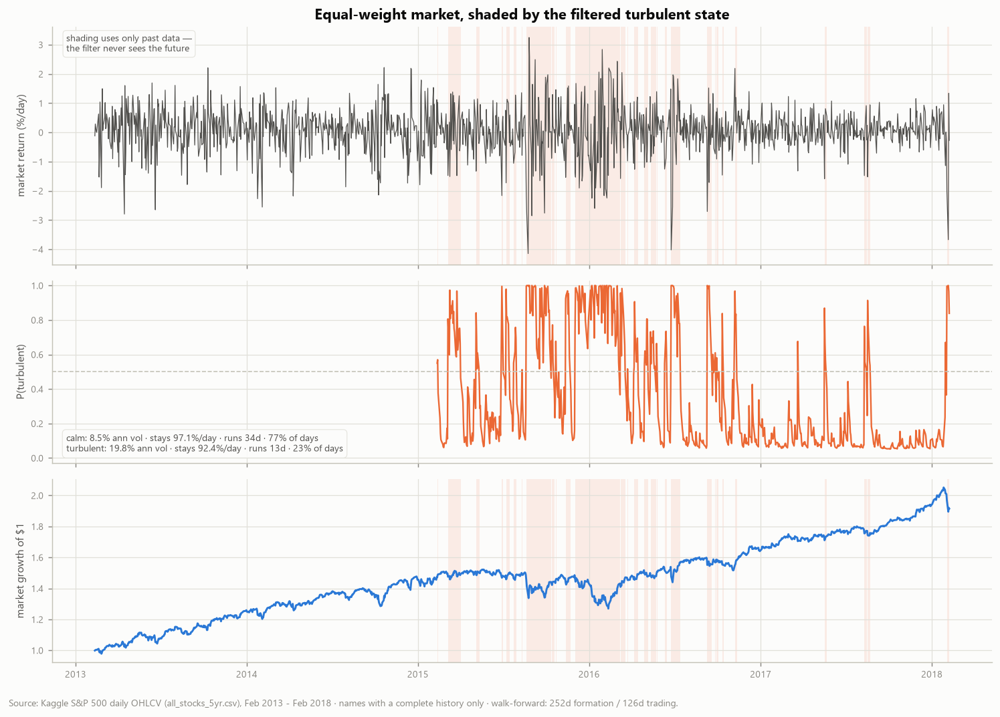
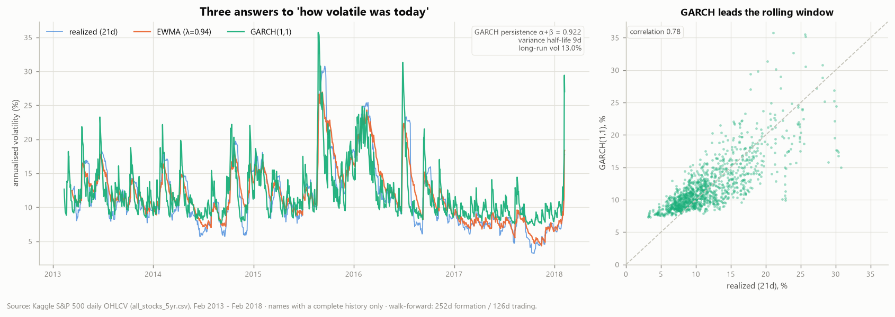
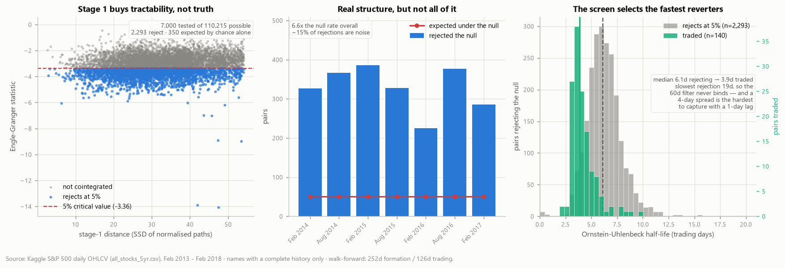
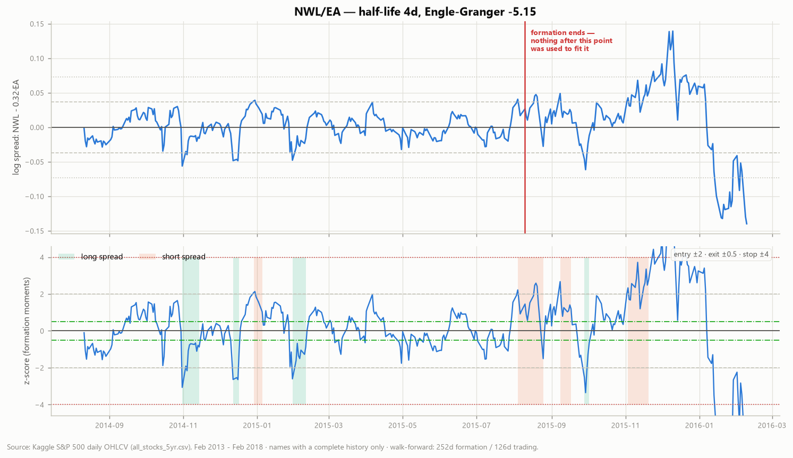
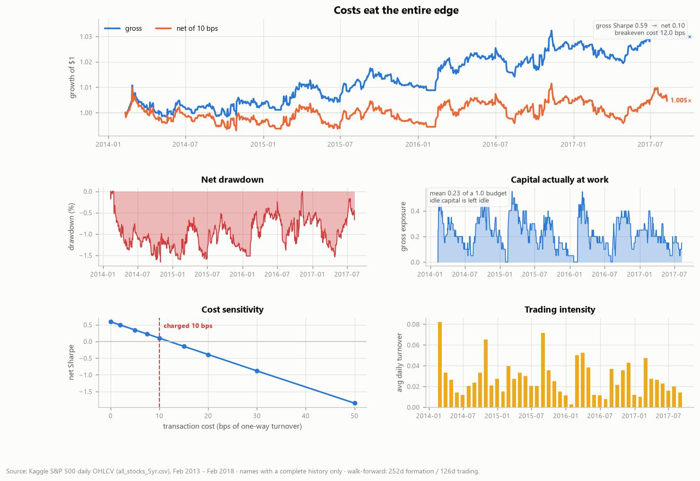
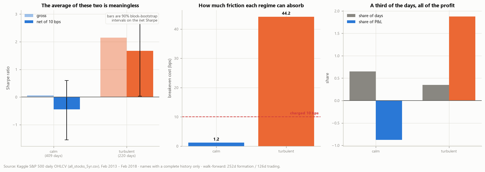

# Project 03 — Pairs Trading & Volatility Regimes


Time-series econometrics built from first principles — unit-root testing, cointegration,
GARCH and a hidden Markov model, none of them imported — applied to statistical arbitrage.

> **The question.** Do cointegration-based pair trades survive transaction costs on the
> S&P 500, 2014–2018? And does the answer depend on what the market was doing at the time?

**The unconditional answer is "barely, and not reliably". The conditional answer is the
project.**


| | all traded days | **calm** regime | **turbulent** regime |
|---|---|---|---|
| Days | 882 | 409 (65%) | 220 (35%) |
| Gross Sharpe | 0.59 | 0.06 | **2.15** |
| **Net Sharpe** (10 bps) | **0.10** | **−0.44** | **+1.67** |
| 90% bootstrap interval | [−0.64, +0.84] | [−1.55, +0.60] | [**+0.04**, +2.92] |
| Break-even cost | 12.1 bps | **1.2 bps** | **44.2 bps** |
| Share of total P&L | 100% | **−88%** | **+188%** |

*Walk-forward: 252-day formation / 126-day trading, non-overlapping. 10 bps per unit of
one-way turnover, one-day execution lag. Regime labels are causal — fitted on a 504-day
burn-in and filtered forward.*

Four conclusions, each backed by a figure below:

1. **The unconditional Sharpe of 0.10 is an average of a strategy that works and one that
   burns money**, and it describes neither. In calm markets the strategy needs execution
   below **1.2 bps** to break even. In turbulent markets it survives **44 bps**.
2. **That split is the most robust thing in the study.** Across all 12 cells of the parameter
   grid, turbulent-regime Sharpe is positive in **12 of 12** and calm-regime Sharpe is
   negative in **12 of 12** — while the unconditional Sharpe flips sign depending on the cell.
   §5 also notes that the headline cell is the *best* unconditional cell in that grid.
3. **The screen is mostly measuring its own significance level.** 2,293 of 7,000 tests reject
   at 5% against 350 expected under the null — real structure at 6.6× the noise rate, but
   ~15% of "discoveries" are noise, and testing all 110,215 possible pairs would have produced
   38,575 rejections from nothing at all. §2.
4. **The screen systematically selects the spreads hardest to trade.** The Engle-Granger
   statistic is largest where reversion is fastest, so ranking by it drags the median traded
   half-life from 6.1 days down to **3.9 days** — precisely the horizon a one-day execution
   lag cannot capture. §2.

**The honest caveat, stated up front:** the turbulent-regime result rests on 220 days. Its 90%
bootstrap interval has a lower bound of **+0.04** — it clears zero, and only just. Treat it as
suggestive, not established. §7.

---

## Contents

1. [What "turbulent" means](#1-what-turbulent-means)
2. [The screen, and its arithmetic](#2-the-screen-and-its-arithmetic)
3. [The trading rule](#3-the-trading-rule)
4. [Where the edge goes: transaction costs](#4-where-the-edge-goes-transaction-costs)
5. [Parameter robustness — the conditional result holds, the unconditional one does not](#5-parameter-robustness--the-conditional-result-holds-the-unconditional-one-does-not)
6. [What keeps the test honest](#6-what-keeps-the-test-honest)
7. [Honest limitations](#7-honest-limitations)
8. [Repository layout](#8-repository-layout) · [Running it](#9-running-it)
10. [What I'd do next](#10-what-id-do-next) · [References](#11-references)

---

## 1. What "turbulent" means

A two-state Gaussian hidden Markov model, fitted by Baum-Welch on the equal-weight market
return. The states are latent — nothing tells the model what volatility is; it finds two
regimes because two regimes fit better than one.



| state | ann. volatility | stay probability | expected run | share of days |
|---|---|---|---|---|
| calm | 8.5% | 0.971 | 34.0 days | 77.2% |
| turbulent | 19.8% | 0.924 | 13.2 days | 22.8% |

Two things make this usable rather than decorative:

**It is causal.** Parameters come from a 504-day burn-in and are then frozen while the filter
runs forward. `P(state_t)` uses only data through `t`. The smoothed posterior — which uses the
whole sample and makes a much cleaner chart — is computed and stored, and is never used for
anything that touches P&L. Conditioning realised returns on a hindsight-fitted label produces
a decomposition that looks sharp and means nothing.

**It agrees with something simpler.** The HMM's "turbulent" label matches the top tercile of
EWMA volatility on **82.9%** of days. The two share no machinery, so the agreement is evidence
the states are picking up something real rather than an artefact of EM.

The volatility estimators themselves are compared directly:



The GARCH(1,1) fit gives α = 0.179, β = 0.743, persistence **0.922**, a variance half-life of
8.6 days and a long-run annualised volatility of 13.0%. [`docs/METHOD.md §4`](docs/METHOD.md)
documents why the persistence is reported and the α/β split is not: repeated fits on simulated
paths recover α+β to ±0.004 at 4,000 observations while α itself is only pinned to ±0.004
around a biased centre, because the likelihood is nearly flat along the ridge trading one
against the other.

---

## 2. The screen, and its arithmetic



470 names with complete histories make **110,215** possible pairs. Testing all of them in each
of 7 windows is millions of regressions, and — more importantly — it is statistically
meaningless. So the screen is a two-stage funnel:

**Stage 1, distance.** Rank all pairs by the sum of squared deviations between normalised log
price paths (Gatev et al.). This consumes no hypothesis test. Keep the closest 1,000.

**Stage 2, cointegration.** Engle-Granger on each survivor: OLS hedge ratio, then an ADF test
on the residual against the `N=2` critical values that account for β having been estimated.
Both orderings are tried and the stronger kept.

### The multiplicity accounting

| | |
|---|---|
| Pairs possible in the universe | 110,215 |
| Pairs tested (7 windows × 1,000) | 7,000 |
| Rejections at 5% | **2,293** |
| Rejections expected under the null | **350** |
| Rejections expected had every pair been tested | **38,575** |
| Pairs actually traded | 140 |

2,293 against 350 is 6.6× the null rate: there is real cointegration structure in the S&P 500,
and this is not all noise. But it also means roughly **15% of the rejections are noise**, and
the counterfactual number is the one worth sitting with — a screen that tested every pair
would have "found" 38,575 cointegrated pairs in a world where none existed.

### The screen selects against itself

The third panel above is the finding I did not expect. The Engle-Granger statistic is most
negative where reversion is fastest, so ranking candidates by strength of evidence
systematically picks the fastest-reverting spreads:

- median half-life among all 2,293 rejections: **6.1 days**
- median half-life among the 140 actually traded: **3.9 days**
- slowest rejection in the entire sample: 19.4 days

The 60-day upper half-life filter, included on the theory that a slowly-reverting spread is
untradable inside a 126-day window, turns out to be **entirely non-binding** — only 10 pairs
were excluded by the bounds at all, all at the fast end. Over a 252-day formation window the
test simply does not reject for slow spreads.

That is a selection effect working against the strategy. A spread that halves in 4 days is the
one most likely to be microstructure noise rather than economic linkage, and the one least
capturable when positions are decided on today's close and executed against tomorrow's.

---

## 3. The trading rule



Everything is frozen at the end of formation and applied unchanged: which pairs to trade, the
hedge ratio α and β, and the spread's mean and standard deviation. Enter against a deviation
at |z| > 2, close inside |z| < 0.5, abandon the pair for the rest of the window at |z| > 4.

The frozen z-score moments matter most. Standardising a trading window by its *own* mean and
standard deviation guarantees the spread looks mean-reverting over that window, because it has
been centred on its own realised mean. It is the single easiest way to manufacture a profitable
pairs backtest and it is wrong.

Each pair runs at gross exposure 1 and capital is split equally across the pairs selected in a
window, so book gross exposure never exceeds 1. Idle capital stays idle — average gross
exposure is **0.23** — rather than levering active pairs up to a constant. The alternative
would turn a window in which one pair triggers into a full-size single-pair bet.

---

## 4. Where the edge goes: transaction costs



| cost (bps) | 0 | 5 | 7.5 | **10** | 15 | 20 | 30 |
|---|---|---|---|---|---|---|---|
| net Sharpe | 0.59 | 0.35 | 0.22 | **0.10** | −0.15 | −0.39 | −0.88 |

Break-even is **12.1 bps** against the 10 bps charged. The strategy is, unconditionally, a
coin flip that happens to land marginally positive at this particular cost assumption — which
is exactly why the unconditional number is the wrong one to quote.

Splitting by regime is where it becomes a result rather than a shrug:



| | calm | turbulent |
|---|---|---|
| Gross ann. return | +0.08% | **+3.12%** |
| Net ann. return | −0.61% | **+2.41%** |
| Cost drag | 0.69% | 0.70% |
| Avg daily turnover | 0.027 | 0.028 |
| **Break-even cost** | **1.2 bps** | **44.2 bps** |

The cost drag and the turnover are **the same in both regimes** — 0.69% vs 0.70% annually.
The strategy is not trading harder in turbulence. What changes is entirely the gross edge:
0.08% a year in calm markets against 3.12% in turbulent ones. Wider dislocations mean bigger
spreads to capture against an unchanged bill.

Calm markets contribute **−88%** of the total P&L over 409 days; turbulent markets contribute
**+188%** over 220. A third of the days produce more than all of the profit, and the other two
thirds actively give some of it back.

---

## 5. Parameter robustness — the conditional result holds, the unconditional one does not

Following project 02's precedent of reporting the whole grid rather than the flattering cell:

| entry | max pairs | net Sharpe | calm | turbulent |
|---|---|---|---|---|
| 1.5 | 10 | −0.47 | −1.63 | **+1.07** |
| 1.5 | 20 | +0.06 | −0.63 | **+1.90** |
| 1.5 | 40 | −0.11 | −0.86 | **+1.14** |
| 2.0 | 10 | −0.52 | −1.58 | **+0.82** |
| **2.0** | **20** | **+0.10** | **−0.44** | **+1.67** |
| 2.0 | 40 | −0.05 | −0.65 | **+0.89** |
| 2.5 | 10 | −0.35 | −1.26 | **+0.53** |
| 2.5 | 20 | −0.01 | −0.77 | **+1.17** |
| 2.5 | 40 | −0.14 | −0.46 | **+0.58** |
| 3.0 | 10 | −0.24 | −0.96 | **+0.61** |
| 3.0 | 20 | −0.16 | −1.06 | **+1.23** |
| 3.0 | 40 | −0.11 | −0.36 | **+0.96** |

Two readings, and both belong in the write-up:

**The conditional sign pattern is completely stable.** Turbulent-regime Sharpe is positive in
12 of 12 cells (+0.53 to +1.90). Calm-regime Sharpe is negative in 12 of 12 (−0.36 to −1.63).
No parameter choice reverses either. That is a far stronger claim than any single number in
the table.

**The unconditional Sharpe is not stable, and the headline cell is the best one in the grid.**
Only 2 of 12 cells are positive, and the reported configuration (entry 2.0, 20 pairs, +0.10)
is the highest of all twelve. Had a different cell been chosen as the headline the
unconditional result would read as a clear negative. This is the same trap project 02 flagged
against itself, and the same conclusion applies: **the unconditional number should not be
quoted at all.** The parameter choice was fixed before the grid was run, but that is a claim
about process, not evidence, and the grid is the evidence.

---

## 6. What keeps the test honest

`python scripts/validate.py` — **8/8 gates in 8.7 s**, exits non-zero on failure, wired into
CI. No market data required; every gate builds its own.

| # | gate | result |
|---|---|---|
| 1 | Simulated ADF critical values vs MacKinnon (2010), 3 cases | max deviation **0.015** (tol 0.05) |
| 2 | ADF size on true random walks | 0.048 rejection rate, **0.29 σ** from nominal 5% |
| 3 | ADF power on stationary AR(1), φ=0.9 | **1000/1000** rejected |
| 4 | Engle-Granger recovers a known hedge ratio | 1.408 vs true 1.400 |
| 5 | OU half-life recovers a known φ | 13.79d vs true 13.51d |
| 6 | GARCH(1,1) persistence recovery | 0.9752 vs true 0.9800 |
| 7 | HMM state recovery on a simulated 2-regime path | **97.8%** accuracy |
| 8 | **Look-ahead**: rewriting the last bar cannot change earlier P&L | difference **exactly 0** |

Gate 1 is the load-bearing one. The project generates its own Dickey-Fuller null distribution
by Monte Carlo and compares it against the published response surfaces — if the ADF regression
were wrong, the two tables would disagree and every p-value in the study would be mis-scaled.
They agree to 0.004 or better at the production settings.

Gate 8 is the one that would catch the subtlest error. The full pipeline is re-run on a panel
whose final row has been multiplied by 1.5, and every earlier day of P&L must return
bit-identical. Selection, hedge ratios, spread moments and z-scores are all estimated from
data, so a single misplaced `shift` anywhere in that chain shows up here and nowhere else.

Plus **66 unit tests** covering the estimators against closed forms and known answers,
including that EM never decreases the log-likelihood, that the HMM filter ignores the future
while the smoother does not, and that expanding-window regime terciles do not relabel a day
when later data is appended.

*One bug this suite actually caught:* `ewma_vol` originally seeded its recursion with the
variance of the whole series, which made every value depend on returns from years later — a
function documented as causal, silently leaking the future into the regime labels built from
it. The test `test_ewma_uses_only_past_returns` failed, and the seed now comes from a leading
window with the burn-in returned as `NaN`.

---

## 7. Honest limitations

1. **The turbulent result rests on 220 days.** The 90% block-bootstrap interval is
   [+0.04, +2.92] — it excludes zero by a hair. The i.i.d. asymptotic standard error is 1.07,
   putting the point estimate 1.6 σ from zero. Both are reported; neither supports treating
   1.67 as a reliable Sharpe.
2. **Survivorship bias is worse here than in a cross-sectional study.** Requiring a complete
   five-year history (505 → 470 names) deletes exactly the event a pair trade is most exposed
   to: one leg acquired, halted, or repriced by a shock the other does not share. The results
   are optimistic by an amount this dataset cannot measure. See
   [`data/README.md §2`](data/README.md).
3. **The unconditional headline is the best cell in its own parameter grid.** See §5.
4. **A 3.9-day median half-life is measured on daily closes.** With a one-day execution lag,
   much of the modelled reversion is not reachable, and the gap between gross and net
   understates real-world slippage — there are no bid-ask spreads in this data.
5. **No sector restriction is possible.** The dataset carries no classification, so pairs are
   formed on price behaviour alone and some have no economic reason to co-move.
6. **Costs are a flat 10 bps.** Real costs vary by name, size and — relevantly — by regime:
   spreads widen in exactly the turbulent conditions where this strategy makes its money, so
   the 44.2 bps break-even is more comfortable in the model than in practice.
7. **No borrow costs or shorting constraints.** Every short leg is assumed freely available
   at zero fee.
8. **One market cycle.** 2013–2018 contains no 2008 and no 2020. The "turbulent" regime here
   is the 2015 devaluation and the early-2016 selloff.

---

## 8. Repository layout

```
03-pairs-trading-regimes/
  README.md                 this write-up
  requirements.txt          pinned minimum versions
  data/README.md            the data card (defers to project 02 for provenance)
  data/sample_prices.csv    40-ticker sample for CI
  docs/METHOD.md            derivations: ADF, Engle-Granger, GARCH, Baum-Welch
  src/statarb/
    cointegration.py        ADF, MacKinnon tables, Engle-Granger, OU half-life
    volatility.py           realized, EWMA, GARCH(1,1) MLE
    regimes.py              Gaussian HMM (Baum-Welch, Viterbi), tercile baseline
    pairs.py                two-stage screen, z-score rule, position sizing
    strategy.py             the walk-forward protocol
    backtest.py             daily-rebalance engine with costs
    attribution.py          regime decomposition, bootstrap intervals
    metrics.py              performance metrics (identical to project 02's)
    validation.py           the 8 correctness gates
    plotting.py / style.py  figures and the shared palette
    tables/df_quantiles.csv generated null distribution (a model constant)
  scripts/                  numbered by pipeline stage
  tests/test_statarb.py     66 tests
  reports/                  generated figures/ and tables/ — never hand-edited
```

## 9. Running it

```bash
python -m venv .venv && source .venv/bin/activate   # Windows: .venv\Scripts\activate
pip install -r requirements.txt

# place all_stocks_5yr.csv in data/ — or reuse project 02's copy (see data/README.md)

python scripts/validate.py        # 8/8 correctness gates
python -m pytest tests -q         # 66 tests

python scripts/screen_pairs.py    # figures 01-02, screen tables
python scripts/fit_regimes.py     # figures 03-04, regime tables
python scripts/run_backtest.py    # figures 05-06 + the composite, all metrics
```

### Which script produces which output

| script | figures | tables |
|---|---|---|
| `tabulate_df.py` | — | `src/statarb/tables/df_quantiles.csv` (build step) |
| `make_sample.py` | — | `data/sample_prices.csv` (build step) |
| `screen_pairs.py` | `01_screening`, `02_spread_example` | `window_screen`, `selected_pairs`, `screen_multiplicity`, `candidate_tests` |
| `fit_regimes.py` | `03_regimes`, `04_vol_estimators` | `regime_params`, `garch_fit`, `regime_classification` |
| `run_backtest.py` | `05_performance`, `06_regime_attribution`, `pairs_regime_results` | `metrics_summary`, `metrics_extra`, `regime_attribution`, `regime_contribution`, `turnover_by_regime`, `cost_sensitivity`, `robustness_grid`, `window_performance` |

Every number quoted in this README comes from a file in `reports/tables/`. Nothing is
hand-copied.

## 10. What I'd do next

- **Regime-conditional position sizing.** The obvious follow-up is to trade only in the
  turbulent state. It is also the obvious trap: the regime label is causal but the *decision*
  to use it was made after seeing this decomposition, so the honest version needs a fresh
  out-of-sample period rather than a re-run on 2014–2018.
- **A slower half-life by construction.** Filter on half-life *before* ranking, or rank on a
  criterion that does not reward fast reversion, and see whether the 3.9-day selection effect
  in §2 is costing real return.
- **Johansen instead of Engle-Granger**, to test baskets rather than pairs and to remove the
  two-orderings selection bias.
- **Delisting returns.** Without them the tail this strategy is most exposed to is invisible
  (§7.2), and no amount of care elsewhere fixes that.

## 11. References

- Engle, R. and Granger, C. (1987). *Co-integration and error correction.* Econometrica.
- MacKinnon, J. (2010). *Critical values for cointegration tests.* Queen's Economics Dept.
  Working Paper 1227.
- Gatev, E., Goetzmann, W. and Rouwenhorst, K. (2006). *Pairs trading: performance of a
  relative-value arbitrage rule.* Review of Financial Studies.
- Bollerslev, T. (1986). *Generalized autoregressive conditional heteroskedasticity.* Journal
  of Econometrics.
- Hamilton, J. (1989). *A new approach to the economic analysis of nonstationary time series
  and the business cycle.* Econometrica.
- Rabiner, L. (1989). *A tutorial on hidden Markov models.* Proceedings of the IEEE.
