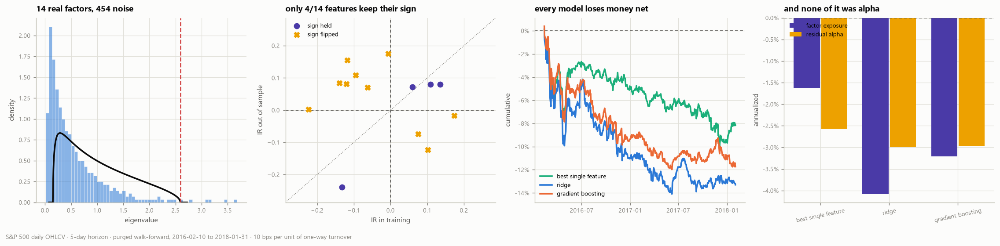
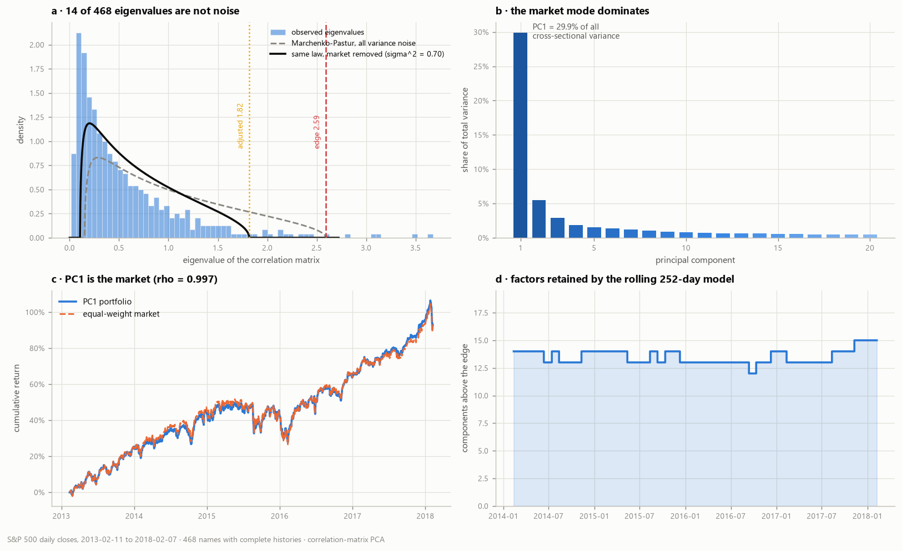
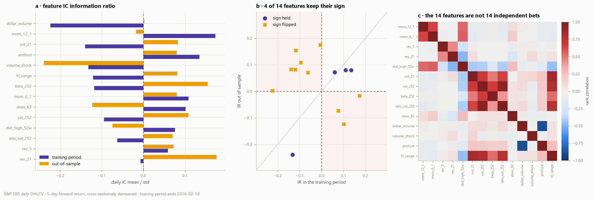
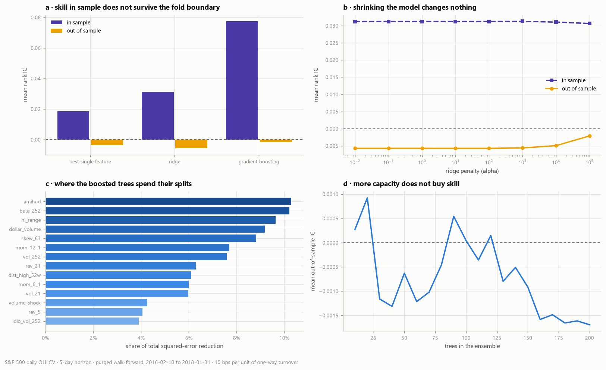
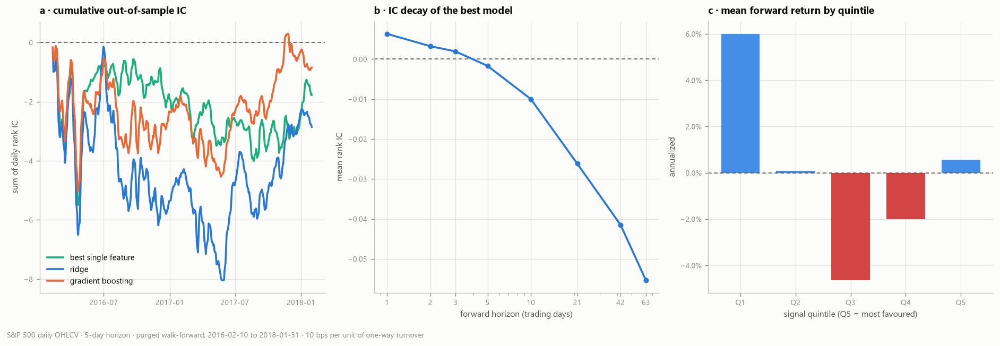
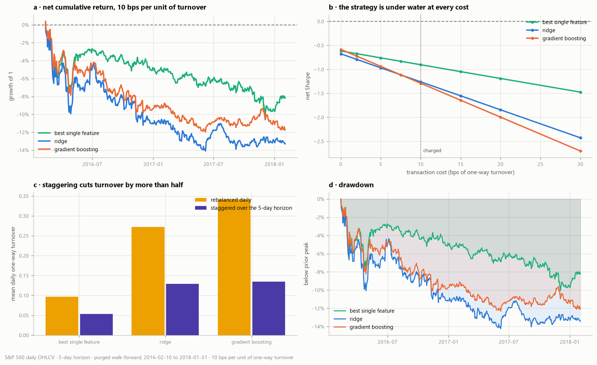
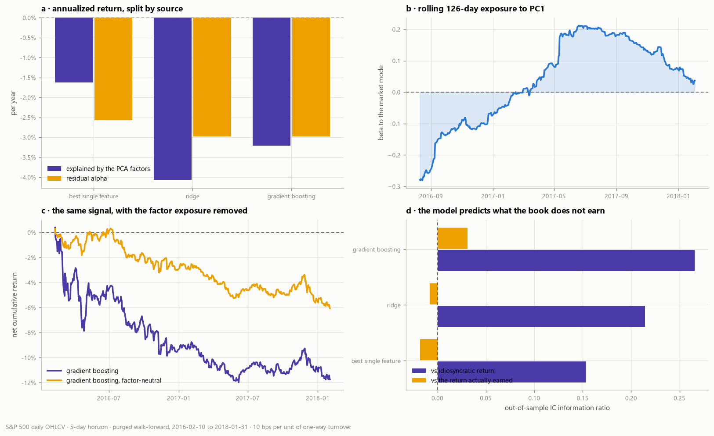

# Project 04 — Machine-Learned Alpha & a PCA Factor Model


Supervised learning built from first principles — ridge through the SVD, a histogram-binned
CART, gradient boosting, and a Marchenko-Pastur factor model, none of them imported from
`scikit-learn` — applied to cross-sectional equity alpha.

> **The question.** Can a machine-learning model find tradable cross-sectional alpha in S&P 500
> daily data, 2013–2018? And if a signal appears, is it alpha or is it a factor exposure?

**The answer is no. This write-up is the anatomy of the no** — which model failed, at what
stage, and, most usefully, which of the standard explanations for the failure the evidence
rules out.



| | best single feature | ridge | gradient boosting |
|---|---|---|---|
| Out-of-sample mean IC | **−0.0035** | **−0.0057** | **−0.0017** |
| IC information ratio | −0.024 | −0.030 | −0.011 |
| Daily hit rate | 51.6% | 51.0% | 50.2% |
| *In-sample* mean IC | +0.0186 | +0.0312 | **+0.0773** |
| Gross Sharpe | −0.62 | −0.68 | −0.58 |
| **Net Sharpe** (10 bps) | **−0.90** | **−1.26** | **−1.29** |
| 90% bootstrap interval | [−1.74, +0.32] | [−2.07, +0.03] | [−2.09, −0.13] |
| Mean daily turnover | 0.053 | 0.129 | 0.134 |
| Break-even cost | −21.4 bps | −11.6 bps | −8.3 bps |

*468,936 rows · 14 features · 5-day forward return, cross-sectionally demeaned · purged
walk-forward with a 5-day embargo, 8 folds, out of sample 2016-02-10 to 2018-01-31 (498 days) ·
10 bps per unit of one-way turnover.*

Five conclusions, each backed by a figure below:

1. **All three models land at zero out-of-sample IC, and the learner is not the binding
   constraint.** Boosting fits the training panel two and a half times harder than ridge does
   (in-sample IC 0.077 against 0.031) and arrives at the same place. A 14-parameter linear model
   and a 200-tree ensemble fail identically. §3.
2. **It is not a variance problem — the usual diagnosis is wrong here.** Sweeping the ridge
   penalty across **seven orders of magnitude** moves the out-of-sample IC from −0.0057 to
   −0.0021 and never above zero, while effective degrees of freedom fall 14.0 → 9.1. The
   boosting learning curve oscillates around zero from 10 trees to 200. Regularisation has
   nothing to fix. §3.
3. **The mechanism is that the relationships do not persist.** Only **4 of 14** features keep
   the sign of their information coefficient across the split — no better than coin flips
   (binomial p = 0.09), which is exactly the assumption every model here depends on and does not
   get. The robustness grid says the same thing from the other end: a **rolling** training window
   beats an expanding one in **6 of 6** paired cells, so old training rows are not merely
   uninformative. §2, §7.
4. **There is no transaction-cost story to tell.** Every model loses money *gross*; all three
   break-even costs are negative. The staggered construction cuts turnover by more than half
   (boosting: 0.342 → 0.134 daily) and improves every Sharpe — and it does not matter, because
   there is no gross edge for it to protect. §4.
5. **Of the loss that exists, roughly half is factor exposure rather than stock selection** —
   and removing it changes the risk, not the result. Factor-neutralising the boosted book halves
   its volatility (4.80% → 2.47%) and its drawdown (−12.3% → −6.4%) while leaving the Sharpe at
   −1.27. The exposure was uncompensated risk the model picked up by accident. §5.

**The honest caveat, stated up front.** A null result is a statement about detection power, not
about the world. With a daily IC standard deviation of 0.15 over 498 out-of-sample days, the
standard error on the mean IC is **0.0067** — so any true IC below roughly **0.013** per day is
invisible to this study, and a signal of that size is a real strategy. What this project shows
is that nothing *large* is there, and it shows precisely why the things that looked large in
sample were not. §9.

---

## Contents

1. [How many factors are real](#1-how-many-factors-are-real)
2. [The features, and the sign test that kills them](#2-the-features-and-the-sign-test-that-kills-them)
3. [Three models, one ceiling](#3-three-models-one-ceiling)
4. [The portfolio: staggering, turnover, costs](#4-the-portfolio-staggering-turnover-costs)
5. [Was it alpha? Newey-West attribution](#5-was-it-alpha-newey-west-attribution)
6. [The one thing that worked: predicting the residual](#6-the-one-thing-that-worked-predicting-the-residual)
7. [Robustness — 12 cells, 0 positive](#7-robustness--12-cells-0-positive)
8. [What keeps the test honest](#8-what-keeps-the-test-honest)
9. [Honest limitations](#9-honest-limitations)
10. [Repository layout](#10-repository-layout) · [Running it](#11-running-it)
12. [What I'd do next](#12-what-id-do-next) · [References](#13-references)

---

## 1. How many factors are real



Before asking a model to find alpha it is worth knowing what the cross-section is made of. The
correlation matrix of 468 names over 1,258 days is decomposed by SVD, and the eigenvalues are
compared against the **Marchenko-Pastur** law — the distribution the eigenvalues of a pure-noise
correlation matrix of the same shape must follow.

| | |
|---|---|
| Names × days | 468 × 1,258 (`q` = 0.372) |
| Noise-bulk upper edge | **2.59** |
| Eigenvalues above it | **14** of 468 |
| Same edge with the market's variance removed (σ² = 0.70) | 1.82 → **27** |
| λ₁ share of total variance | **29.9%** |
| ρ(PC1 portfolio, equal-weight market) | **0.997** |
| Top 5 components | 41.6% of variance |

Three points worth making explicit.

**The count is a decision, not an impression.** Panel (a) is the whole argument: the scree plot
looks like it has twenty interesting components, and fourteen of them clear a threshold a random
matrix could not. "It looks important" is not evidence; the edge is.

**PC1 is the market, and it is not subtle.** A portfolio built on the first eigenvector tracks
the equal-weight index at ρ = 0.997 (panel c). This is why the label is cross-sectionally
demeaned — the single most forecastable component of any stock's return is the one a
dollar-neutral book cannot trade.

**The market-adjusted edge cuts the opposite way to intuition.** Removing the market mode's
variance from the noise pool *lowers* the edge to 1.82 and so declares **more** components
significant, not fewer — 27 instead of 14. The unadjusted count is the conservative one and is
the number quoted everywhere else in this write-up.
[`docs/METHOD.md §3`](docs/METHOD.md) explains why the adjustment is applied once and never
iterated: an early version iterated to a fixed point and confidently reported 283 factors out of
468.

Panel (d) refits the model on a rolling 252-day window: the retained count sits between 12 and
15 for the whole sample, so the factor structure is stable even though the loadings are not.

---

## 2. The features, and the sign test that kills them



Fourteen features across four families, all computable from daily OHLCV and all cross-sectionally
ranked into `[-0.5, 0.5]` before use — `mom_12_1`, `mom_6_1`, `dist_high_52w` (trend); `rev_5`,
`rev_21` (reversal); `vol_21`, `vol_252`, `beta_252`, `idio_vol_252`, `skew_63` (risk);
`dollar_volume`, `volume_shock`, `amihud`, `hl_range` (liquidity).

The single most informative table in the project is panel (b), and it is a sign test:

| | training period | out of sample |
|---|---|---|
| Days | 505 | 498 |
| Best feature by \|IC IR\| | `dollar_volume`, −0.223 | `volume_shock`, −0.239 |
| **Features keeping their IC sign** | — | **4 of 14** |

Under a null of no persistence each feature is a coin flip, and 4-or-fewer heads out of 14 has
probability **0.09**. That is not significant evidence of *anti*-persistence, and it should not
be read as such. What it rules out is the assumption every model in §3 depends on: that a
relationship measured in the training period is still pointing the same way in the test period.

`mom_12_1` is the clearest case. Classic 12-1 momentum has the strongest training-period IC of
any trend feature at +0.036 (IR +0.17) and lands at **−0.004** out of sample. Nothing was
mis-specified; the effect simply is not there in 2016–2018 at a 5-day horizon.

Panel (c) adds the other constraint on what any model could do: the fourteen features are not
fourteen independent bets. The four volatility-like features form a block correlated 0.64 to
**0.93** (`vol_252` against `idio_vol_252` is the maximum, which is close to a tautology — one is
the other with the market component removed), and `dollar_volume` against `amihud` reaches
**−0.90**, also by construction, since Amihud illiquidity is a return-to-volume ratio. Only
`beta_252` sits loosely enough against the volatility block (0.41 to 0.67) to count as a separate
bet. The effective breadth of the feature set is well below 14.

---

## 3. Three models, one ceiling




Three learners, deliberately spanning a wide capacity range, run through the identical purged
walk-forward:

- **best single feature** — picks the highest-\|IC\| feature on the training fold and uses it
  raw. The control: any model that cannot beat this has learned nothing from having fourteen.
- **ridge**, α = 100, solved through the SVD. 14 parameters.
- **gradient boosting**, 200 trees, depth 3, learning rate 0.05, 500 rows minimum per leaf,
  70% row subsampling.

**Capacity buys in-sample skill and nothing else** (panel a). Boosting fits the training panel
two and a half times harder than ridge does — in-sample IC 0.077 against 0.031, information ratio
0.64 against 0.21 — and its out-of-sample IC is −0.0017. Ridge goes
0.031 → −0.0057. The gap scales with capacity exactly as overfitting predicts, but the
*destination* does not: all three arrive at zero.

**Shrinking the model changes nothing** (panel b). This is the panel that rules out the standard
diagnosis:

| ridge α | 0.01 | 1 | 100 | 10³ | 10⁴ | 10⁵ |
|---|---|---|---|---|---|---|
| effective d.o.f. | 14.00 | 14.00 | 13.98 | 13.79 | 12.60 | **9.08** |
| in-sample IC | 0.0312 | 0.0312 | 0.0312 | 0.0312 | 0.0310 | 0.0306 |
| **out-of-sample IC** | −0.0057 | −0.0057 | −0.0057 | −0.0056 | −0.0049 | **−0.0021** |

If the failure were variance, some interior α would trade a little in-sample fit for
out-of-sample gain. Instead the out-of-sample line is flat and below zero across seven orders of
magnitude, and only creeps toward zero as the penalty crushes the model toward the constant
predictor. The best available regularisation is to not have a model.

Panel (d) tells the same story for the ensemble: out-of-sample IC wanders inside ±0.002 from 10
trees to 200 with no trend. There is no early-stopping point that was missed.

**`R²` behaves exactly as [`docs/METHOD.md §1`](docs/METHOD.md) predicted it would**: −0.004 for
ridge and −0.007 for boosting, i.e. both are worse than predicting the cross-sectional mean, even
though ranking skill is what the strategy needs and `R²` is not it. (The figure quoted for the
best-single-feature model, −83, is not comparable — it emits a rank, not a return forecast.)

### What little signal there is has the wrong horizon

Figure 03 profiles the best model's signal. The IC decay (panel b) is the interesting one:

| forward horizon | 1d | 2d | 3d | **5d** | 10d | 21d | 63d |
|---|---|---|---|---|---|---|---|
| mean rank IC | **+0.0063** | +0.0032 | +0.0019 | −0.0017 | −0.0100 | −0.0262 | −0.0554 |
| hit rate | 51.6% | 52.2% | 52.4% | 50.2% | 50.5% | 45.9% | 35.9% |

The model was trained on a 5-day label and its IC is *positive at one day*, crosses zero before
its own horizon, and grows steadily more negative out to a quarter. Whatever it has latched onto
is a one-to-three-day effect that subsequently reverses — which is both far too small to trade
(a 0.0063 IC against a 0.0067 standard error) and the horizon at which a model fitted on daily
closes with a one-day execution lag is least able to act.

Panel (c) closes the argument: mean forward return by signal quintile is non-monotone, and the
most-favoured quintile Q5 (+0.011% per 5 days) underperforms the least-favoured Q1 (+0.119%).
The spread the strategy actually trades is **−0.108%** per 5-day period.

---

## 4. The portfolio: staggering, turnover, costs



Signals become a dollar-neutral book by going long the top quintile and short the bottom, then
running `h = 5` overlapping sub-books so each day's prediction is held for exactly the horizon it
was trained to predict (Jegadeesh-Titman; [`docs/METHOD.md §8`](docs/METHOD.md)).

**Staggering is the single largest lever on net performance, and it is not enough** (panel c):

| | best single feature | ridge | gradient boosting |
|---|---|---|---|
| turnover, rebalanced daily | 0.096 | 0.272 | 0.342 |
| turnover, staggered | **0.053** | **0.129** | **0.134** |
| Sharpe, rebalanced daily | −1.13 | −1.68 | −1.96 |
| Sharpe, staggered | −0.90 | −1.26 | −1.29 |
| average holding period | 18.8 d | 7.7 d | 7.2 d |

Turnover falls by 45–61% and every Sharpe improves by 0.2–0.7. On a strategy with an edge that
is the difference between a viable book and an unviable one. Here it moves the result from very
bad to bad.

**The cost sensitivity panel (b) is where the negative result becomes unambiguous.** Every line
starts below zero at **0 bps** and only falls:

| cost (bps) | 0 | 5 | **10** | 20 | 30 |
|---|---|---|---|---|---|
| best single feature | −0.62 | −0.76 | **−0.90** | −1.19 | −1.47 |
| ridge | −0.68 | −0.97 | **−1.26** | −1.84 | −2.43 |
| gradient boosting | −0.58 | −0.94 | **−1.29** | −2.00 | −2.70 |

Break-even costs are −21.4, −11.6 and −8.3 bps — negative, which is the arithmetic saying there
is no cost low enough. Projects 02 and 03 both ended at "the edge is real gross and eaten by
costs". This one cannot make that claim and does not.

The honest reading of the gross numbers, though, is *not* "the models reliably lose money". A
Sharpe estimated over two years carries a standard error near 0.7, so a gross Sharpe of −0.6 is
statistically indistinguishable from zero — which is exactly what a zero IC predicts. The
reliable part is the cost: the 90% block-bootstrap interval on the boosted book's **net** Sharpe
is [−2.09, −0.13] and excludes zero.

---

## 5. Was it alpha? Newey-West attribution



Each book's daily return is regressed on the first five principal components of the same
universe, with Newey-West standard errors at 5 lags — mandatory here, because a staggered book
holds its positions for a week by construction and its returns are autocorrelated by design.

| | best single feature | ridge | gradient boosting |
|---|---|---|---|
| Total annualised return | −4.19% | −7.05% | −6.19% |
| ...explained by the 5 factors | −1.62% | −4.07% | −3.21% |
| ...residual "alpha" | −2.57% | −2.98% | −2.98% |
| Alpha t-statistic (NW) | −0.83 | −0.85 | **−1.02** |
| R² on the factors | 0.199 | 0.327 | 0.324 |

A third of the boosted book's daily variance is factor exposure it was never asked to take, and
half its loss comes from there. The rolling 126-day beta to PC1 (panel b) swings from **−0.28 to
+0.21** over the out-of-sample period — a supposedly dollar-neutral book carrying a market
exposure that drifts across the sign line, because ranking on features that correlate with beta
produces a portfolio tilted on beta.

None of the alpha t-statistics reaches significance. The correct statement is not "the models
have negative alpha"; it is **"there is no evidence of alpha in either direction, and the point
estimate is negative"**.

**Neutralising the exposure is the cleanest result in the section** (panel c). Projecting the
book onto the orthogonal complement of the factor loadings:

| gradient boosting | raw | factor-neutral |
|---|---|---|
| Annualised volatility | 4.80% | **2.47%** |
| Max drawdown | −12.3% | **−6.4%** |
| CAGR | −6.11% | −3.11% |
| **Sharpe** | −1.290 | **−1.268** |

Volatility and drawdown halve; the Sharpe does not move. The factor exposure was contributing
risk and return in the same proportion as the rest of the book — it was neither the source of the
loss nor a hedge against it, just uncompensated variance that a neutralisation step removes for
free. Any real deployment should run neutralised regardless of the signal.

---

## 6. The one thing that worked: predicting the residual

If the models cannot forecast total returns, can they forecast the part a factor portfolio does
not already deliver? The label is rebuilt as the forward **idiosyncratic** return — the residual
from a causal rolling PCA fitted on 252 days and applied forward 21 — and everything else is
held fixed.

| | IC vs residual | IR vs residual | IC vs total return | gross Sharpe | break-even |
|---|---|---|---|---|---|
| best single feature | +0.0095 | +0.153 | −0.0031 | −0.41 | −3.3 bps |
| ridge | +0.0142 | +0.214 | −0.0011 | −0.30 | −2.6 bps |
| **gradient boosting** | **+0.0167** | **+0.266** | +0.0034 | **+0.03** | **+0.3 bps** |

This is the only positive finding in the study, and it is worth stating precisely. Against
idiosyncratic returns all three models have a positive out-of-sample IC, ordered by capacity, and
the boosted model reaches an IC information ratio of **0.27** — the sort of number a real signal
produces. Against the returns a portfolio actually earns, the same models are at zero.

The gap is the point. The models are learning something about the residual cross-section, and it
is being swamped by factor variance the moment the signal is turned into a book. A break-even
cost of **0.3 bps** says the effect is real and completely untradable at this size — but it also
says the place to look next is a factor-neutral construction, not a better learner. §12.

**This section is also where the project's worst bug lived.** An earlier residualizer added the
fitting window's mean back when un-standardising, which subtracted each stock's trailing 252-day
drift from its own forward residual and made momentum "predict" it at an IC IR of **−1.34** on a
synthetic panel containing nothing to predict. It produced a stable, plausible, publication-shaped
result, and every other check in the project passed while it was there.
[`docs/METHOD.md §10`](docs/METHOD.md) documents it in full; gate 4 now guards it.

---

## 7. Robustness — 12 cells, 0 positive

Following the precedent set in projects 02 and 03, the whole grid is reported rather than the
flattering cell. Ridge, α = 100, across three horizons × two targets × two training-window rules:

| horizon | target | window | IC vs total | gross Sharpe | **net Sharpe** | break-even |
|---|---|---|---|---|---|---|
| 1 | total | expanding | +0.0018 | −0.46 | −1.78 | −3.5 bps |
| 1 | total | rolling | +0.0013 | −0.39 | −1.48 | −3.5 bps |
| 1 | residual | expanding | +0.0053 | −0.12 | −2.24 | −0.6 bps |
| 1 | residual | rolling | +0.0070 | +0.28 | −1.75 | +1.4 bps |
| **5** | **total** | **expanding** | **−0.0057** | **−0.68** | **−1.26** | **−11.6 bps** |
| 5 | total | rolling | −0.0021 | −0.32 | −0.88 | −5.8 bps |
| 5 | residual | expanding | −0.0011 | −0.30 | −1.45 | −2.6 bps |
| 5 | residual | rolling | +0.0059 | +0.39 | −0.81 | +3.2 bps |
| 21 | total | expanding | −0.0422 | −1.21 | −1.40 | −62.2 bps |
| 21 | total | rolling | −0.0293 | −0.94 | −1.12 | −51.1 bps |
| 21 | residual | expanding | −0.0225 | −0.72 | −1.13 | −17.7 bps |
| 21 | residual | rolling | +0.0016 | +0.15 | **−0.25** | +3.7 bps |

**0 of 12 cells have a positive net Sharpe**, and the headline cell (bold) is neither the best nor
the worst — it is the configuration the scripts default to, and the grid contains six cells worse
than it and five better. No parameter choice rescues the result. That is a weaker claim than it
sounds, since a grid of ridge fits cannot rule out a configuration outside the grid; what it does
rule out is the version of the result that would have been reported had a single flattering cell
been chosen.

Two patterns in the grid are informative rather than decorative:

**A rolling training window beats an expanding one in 6 of 6 paired cells** — by 0.28 to 0.88 of
net Sharpe. Throwing away old data helps, systematically. That is the same finding as §2's sign
test seen from a different angle: the relationship between features and returns is not stable, so
older training rows are not merely uninformative, they are actively misleading.

**Every positive gross Sharpe in the grid is a residual-target cell with a rolling window** —
three of them, +0.15 to +0.39. That is the §6 result reproduced across horizons, and it is the
only structure in the study that survives being looked at from more than one direction.

---

## 8. What keeps the test honest

`python scripts/validate.py` — **11/11 gates in 7.7 s**, exits non-zero on failure, wired into
CI. No market data required; every gate builds its own.

| # | gate | result |
|---|---|---|
| 1 | PCA recovers an exactly-constructed covariance spectrum | max error **2.5e-14** (tol 1e-10) |
| 2 | Eigenvalue distribution vs Marchenko-Pastur, 12 noise panels | KS distance **0.0029** (tol 0.02) |
| 3 | Factor count: 0 on noise, exactly `k` on a planted `k` | 0 error, both directions |
| 4 | **Residualization manufactures no signal on a null panel** | IR **+0.056** (tol 0.12) |
| 5 | Ridge shrinkage identity on an orthonormal design | **1.1e-16** (tol 1e-12) |
| 6 | Ridge coefficient recovery; α=0 reproduces least squares | 0.021; **6e-15** vs `lstsq` |
| 7 | Binned split search vs brute force over representable splits | **7.1e-16** relative shortfall |
| 8 | Boosting learns Friedman #1 | OOS R² **0.948** vs ridge's 0.722 |
| 9 | Purged folds leak no labels, **with an unpurged control** | purged **0**, control **500** |
| 10 | Look-ahead: rewriting the last bar cannot change earlier P&L | difference **exactly 0** |
| 11 | The pipeline recovers a planted cross-sectional signal | OOS IC **0.469**, IR 2.58 |

Gates 4, 9 and 11 are the load-bearing ones, and each exists for a reason the other two cannot
cover.

**Gate 11 is what makes the null result meaningful.** A pipeline that finds nothing is
indistinguishable from a pipeline that is broken, and every negative number in this write-up
would be equally consistent with a misaligned index somewhere in the feature builder. So a signal
of known strength is planted in a synthetic panel and the *entire* chain — features, purging,
folds, ridge, book construction, P&L — must recover it at IC 0.47 and an IR of 2.58. It does.
The machinery works; the data does not contain what the machinery is looking for.

**Gate 9 carries its own control**, because "no overlaps found" is worthless unless the same
counter finds overlaps when purging is switched off. It reports both: 0 overlapping training rows
with purging, 500 without.

**Gate 4 is the subtle one**, and it caught the §6 bug. Note what makes its null correct: the
synthetic panel must have **no cross-sectional dispersion in drift**, because per-stock drift
makes momentum genuinely predictive of the residual, and a null containing a real effect cannot
test for artefacts. A wrong version of this gate "failed" the corrected code at +0.74 and would
have sent the fix in the opposite direction.

Plus **82 unit tests** covering the estimators against closed forms and known answers — that
boosting's training loss is monotone non-increasing stage by stage, that the tree binner is fitted
on training rows only, that the sign convention on the PCA loadings is stable across refits, and
that the staggered book equals the trailing `h`-day mean of the daily target weights.

---

## 9. Honest limitations

1. **A null result is a statement about power.** The standard error on the mean daily IC is
   **0.0067** over 498 out-of-sample days, so any true IC below about 0.013 per day cannot be
   distinguished from zero here — and that is a range containing genuinely tradable signals. The
   claim is "nothing large is present", not "nothing is present".
2. **Two years out of sample, one market regime.** 2016-02 to 2018-01 is an unusually calm,
   steadily rising market. Cross-sectional dispersion — the raw material a long/short book eats —
   was near multi-decade lows for much of it. A model that fails here has not been tested in the
   conditions where cross-sectional alpha is usually found.
3. **Fourteen price-and-volume features, no fundamentals.** The dataset carries no earnings, no
   valuation, no analyst estimates, no sector classification and no news. Most of the published
   cross-sectional ML literature runs on feature sets that include exactly what is missing here,
   and §2 shows the effective breadth of these fourteen is far below fourteen.
4. **Survivorship bias sits inside the training label.** All 468 names have complete five-year
   histories, so the panel is conditioned on surviving. See
   [`data/README.md §2`](data/README.md); project 02 documents the same bias visible directly in
   the file.
5. **The residual result in §6 is measured against this project's own factor model.** A different
   number of components, or a different window, gives a different residual and therefore a
   different target. It should be treated as suggestive of where to look, not as an estimate.
6. **Costs are a flat 10 bps** with no bid-ask spread, no market impact and no borrow cost, on
   daily closes with a one-day execution lag. §3 shows the only positive IC lives at a one-day
   horizon, which is precisely the horizon this cost model represents worst.
7. **Eight folds.** The purged walk-forward spends two years on the initial training window, which
   leaves eight test blocks of one quarter each from a five-year file. Fold-level variation is not
   reported for that reason — with eight points it would be noise presented as analysis.
8. **The models are the standard ones and were not tuned.** Depth, learning rate, leaf size and
   quintile cutoff were fixed before the out-of-sample period was run and never revisited. That is
   the correct protocol, and it also means the boosted model may be mis-specified in a way a proper
   nested search would have caught.

---

## 10. Repository layout

```
04-ml-alpha-pca-factors/
  README.md                 this write-up
  requirements.txt          pinned minimum versions
  data/README.md            the data card (defers to project 02 for provenance)
  data/sample_prices.csv    60-ticker sample for CI
  docs/METHOD.md            derivations: MP law, ridge SVD, CART, boosting, purging,
                            Newey-West, and §10 on the residualization trap
  src/mlalpha/
    data.py                 panel loading, returns, stacking to a design matrix
    features.py             the 14 features and the cross-sectional transforms
    pca.py                  SVD factor model, Marchenko-Pastur edges, rolling residuals
    models.py               ridge via SVD, histogram CART, gradient boosting, binner
    crossval.py             purged walk-forward with embargo, overlap counting
    pipeline.py             the walk-forward driver and the best-feature control
    signals.py              long/short weights, overlapping books, neutralization
    backtest.py             daily-rebalance engine with costs, bootstrap intervals
    diagnostics.py          rank IC, IC decay, quantile profiles, in/out-of-sample split
    attribution.py          factor decomposition, Newey-West OLS, rolling exposure
    metrics.py              performance metrics (shared with projects 02 and 03)
    validation.py           the 11 correctness gates
    plotting.py / style.py  figures and the shared palette
  scripts/                  numbered by pipeline stage
  tests/test_mlalpha.py     82 tests
  reports/                  generated figures/ and tables/ — never hand-edited
```

## 11. Running it

```bash
python -m venv .venv && source .venv/bin/activate   # Windows: .venv\Scripts\activate
pip install -r requirements.txt

# place all_stocks_5yr.csv in data/ — or reuse project 02's copy (see data/README.md)

python scripts/validate.py          # 11/11 correctness gates, ~8 s, no data needed
python -m pytest tests -q           # 82 tests

python scripts/fit_factors.py       # figure 01, the factor tables
python scripts/explore_features.py  # figure 02, the feature IC tables
python scripts/run_models.py        # figures 03-06 + the composite, every model table
```

`run_models.py` is the long one — roughly 30 minutes on a laptop, most of it the boosted
ensemble, which is refitted once per fold for the walk-forward and again for the learning curve.
Add `--quick` for a 60-tree version that skips the robustness grid.

### Which script produces which output

| script | figures | tables |
|---|---|---|
| `make_sample.py` | — | `data/sample_prices.csv` (build step) |
| `fit_factors.py` | `01_factor_structure` | `factor_spectrum`, `factor_summary`, `factor_facts`, `factor_counts` |
| `explore_features.py` | `02_features` | `feature_ic`, `feature_correlation`, `feature_facts` |
| `run_models.py` | `03_signal_quality`, `04_models`, `05_performance`, `06_attribution`, `ml_alpha_results` | `folds`, `model_ic`, `in_sample_vs_oos`, `ridge_alpha_sweep`, `feature_importance`, `gbm_learning_curve`, `metrics_summary`, `turnover_comparison`, `cost_sensitivity`, `attribution`, `neutralization`, `residual_experiment`, `robustness_grid`, `ic_decay`, `quantile_returns` |

Every number quoted in this README comes from a file in `reports/tables/`. Nothing is
hand-copied.

## 12. What I'd do next

- **Build the book factor-neutral from the start**, rather than neutralising afterwards. §5 shows
  neutralisation halves risk for free and §6 shows the only measurable signal is in the residual;
  the natural experiment is to make the residual both the target *and* the tradable object.
- **Fit on a rolling window.** 6 of 6 paired cells in §7 prefer it, which is a stronger statement
  than any single cell in the grid, and it costs nothing to adopt.
- **Widen the feature set before widening the model.** §3 shows capacity is not the constraint,
  so the marginal return on a deeper learner is zero while the marginal return on a fundamentals
  or news feature is unmeasured. Adding a bigger model to this feature set is the mistake this
  project's own evidence argues against.
- **A longer sample with delisted names.** Two years out of sample and a survivorship-filtered
  universe are the two limitations that no amount of care in the modelling can offset.

## 13. References

- Marchenko, V. and Pastur, L. (1967). *Distribution of eigenvalues for some sets of random
  matrices.* Mathematics of the USSR-Sbornik.
- Laloux, L., Cizeau, P., Bouchaud, J.-P. and Potters, M. (1999). *Noise dressing of financial
  correlation matrices.* Physical Review Letters 83.
- Hoerl, A. and Kennard, R. (1970). *Ridge regression: biased estimation for nonorthogonal
  problems.* Technometrics 12.
- Hastie, T., Tibshirani, R. and Friedman, J. (2009). *The Elements of Statistical Learning*, 2nd
  ed.
- Friedman, J. (2001). *Greedy function approximation: a gradient boosting machine.* Annals of
  Statistics 29.
- Ke, G. et al. (2017). *LightGBM: a highly efficient gradient boosting decision tree.* NIPS.
- López de Prado, M. (2018). *Advances in Financial Machine Learning*, ch. 7.
- Jegadeesh, N. and Titman, S. (1993). *Returns to buying winners and selling losers.* Journal of
  Finance 48.
- Newey, W. and West, K. (1987). *A simple, positive semi-definite, heteroskedasticity and
  autocorrelation consistent covariance matrix.* Econometrica 55.
- Gu, S., Kelly, B. and Xiu, D. (2020). *Empirical asset pricing via machine learning.* Review of
  Financial Studies 33 — the benchmark this project's feature set is deliberately narrower than.
</content>
</invoke>
