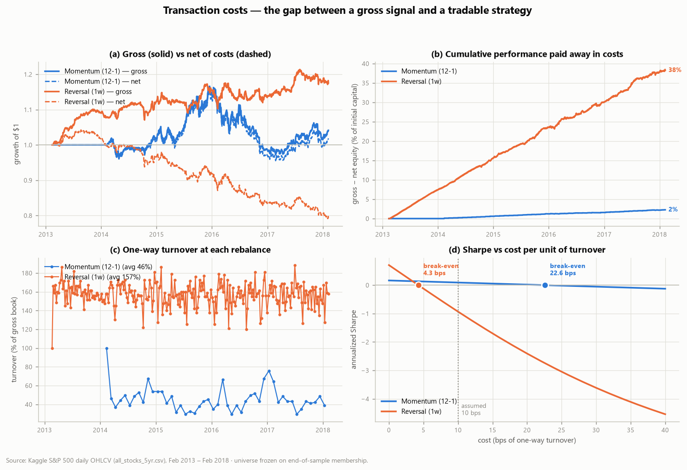
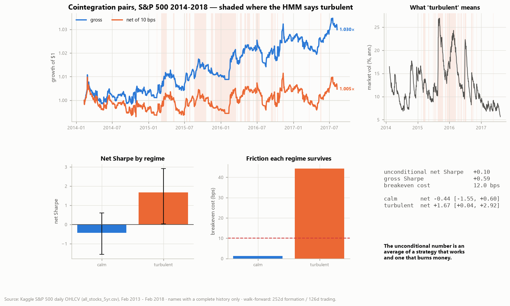

# Quant Research & Development Portfolio

   

Self-contained quantitative-finance projects, each built end-to-end from raw
data or first principles and written up for **quant research / quant developer**
work.

**Jae Woong Choi** — Computational & Data Sciences, George Mason University Honors
College (GPA 4.00, expected May 2028). Seeking a **summer 2027 quantitative research
or quantitative developer internship**. F-1 student, eligible to work on CPT and OPT.
[jchoi224@gmu.edu](mailto:jchoi224@gmu.edu) ·
[LinkedIn](https://www.linkedin.com/in/choijaewoong/) ·
[GitHub](https://github.com/choiverse) · resume available on request.

Three rules every project follows:

1. **Reproducible from code.** One command regenerates every figure and table in
   the write-up. Seeds are fixed and recorded; no result is hand-copied.
2. **Validated against something known.** Where a result can be checked against a
   closed form, an exact moment, or a theoretical scaling law, there is a script
   that does exactly that and exits non-zero if it fails.
3. **Written up honestly.** Negative results are reported as results. Where a
   dataset is defective or a conclusion is weaker than the headline suggests, the
   README says so — see §5 of Project 02, which points out that its own headline
   parameter choice is one of the worst cells in its robustness grid.

---

## Projects

### [01 · Rough Volatility Monte Carlo](01-rough-volatility-monte-carlo)

A from-scratch Monte Carlo engine for the rough Bergomi model, built to test
whether it reproduces the empirical signature that launched the rough-volatility
literature: an at-the-money implied-vol skew decaying as `T^(H−1/2)`.

[](01-rough-volatility-monte-carlo)

| | |
|---|---|
| **Result** | fitted skew exponent **−0.407** vs theoretical **−0.400** |
| **Independent check** | Hurst exponent recovered from the paths: **0.099** (specified 0.100) |
| **Validation** | 6/6 correctness gates · 25 unit tests |
| **Performance** | 200k paths × 100 steps in **1.6 s** (FFT-vectorized hybrid scheme) |
| **Notable finding** | the antithetic standard error was being computed wrong, making the technique look useless — and once fixed, stacking it with a control variate is *worse* than the control variate alone |

`Monte Carlo` · `fractional processes` · `variance reduction` · `implied volatility`
· `FFT optimization` · `OOP model design`

---

### [02 · Systematic Cross-Sectional Equity Backtest](02-systematic-equity-backtest)

A dependency-light backtesting engine plus a study of 12-1 momentum and
short-term reversal on the S&P 500 universe, 2013–2018, evaluated net of costs.

[](02-systematic-equity-backtest)

| | |
|---|---|
| **Result** | a **negative** one: momentum ≈ 0 after costs (Sharpe 0.09), reversal outright unprofitable (−0.93) |
| **Why** | reversal's Sharpe goes **+0.71 gross → −0.93 net**; it needs sub-**4.3 bps** execution to break even |
| **Data audit** | flagged 20 defective rows (9 with impossible OHLC prices, 11 with missing fields) and 4 unadjusted corporate actions masquerading as ±50% returns |
| **Bias quantified** | survivorship bias visible directly in the data — listed names rise 476 → 505 and never fall |
| **Validation** | 30 unit tests, including a look-ahead test that rewrites the last day's returns and requires every earlier P&L to be unchanged |

`pandas panel data` · `vectorized backtesting` · `information coefficient` ·
`transaction-cost modeling` · `survivorship & look-ahead bias` · `robustness surfaces`

---

### [03 · Pairs Trading & Volatility Regimes](03-pairs-trading-regimes)

Cointegration-based statistical arbitrage on the S&P 500, with the econometrics
built rather than imported — ADF, Engle-Granger, GARCH(1,1) and a two-state
hidden Markov model, none of them from `statsmodels`.

[](03-pairs-trading-regimes)

| | |
|---|---|
| **Result** | the unconditional net Sharpe of **0.10** is an average of **+1.67** in turbulent markets and **−0.44** in calm ones, and describes neither |
| **Why** | the cost drag is identical across regimes (0.69% vs 0.70%/yr); only the gross edge changes, so break-even goes **1.2 bps → 44.2 bps** |
| **Independent check** | the HMM's regime labels agree with the top tercile of EWMA volatility on **82.9%** of days, sharing no machinery |
| **Validation** | 8/8 correctness gates · 66 unit tests · the project's own Monte Carlo reproduces MacKinnon's cointegration critical values to **0.004** |
| **Notable finding** | ranking candidates by strength of evidence drags the median traded half-life from 6.1 days to **3.9** — the screen systematically selects the spreads a one-day execution lag cannot capture |

`cointegration` · `unit-root testing` · `hidden Markov models` · `GARCH` ·
`Baum-Welch EM` · `multiple-testing control` · `walk-forward validation`

---

### [04 · Machine-Learned Alpha & a PCA Factor Model](04-ml-alpha-pca-factors)

Ridge, CART and gradient boosting written from scratch, plus a Marchenko-Pastur factor
model, asking whether a learner can find tradable cross-sectional alpha in S&P 500 daily
data — and whether what it appears to find is alpha or a factor exposure.

[](04-ml-alpha-pca-factors)

| | |
|---|---|
| **Result** | a negative one, and a sharp one: all three models land at ~0 out-of-sample IC (−0.006 to −0.002) and every book loses money **gross**, so there is no cost story to tell |
| **Why** | not model variance — sweeping the ridge penalty across **7 orders of magnitude** never lifts the out-of-sample IC above zero. Only **4 of 14** features keep the sign of their IC across the split, and a rolling training window beats an expanding one in 6 of 6 paired cells |
| **What did work** | against *idiosyncratic* returns the boosted model reaches an IC information ratio of **0.27** while scoring zero against the returns a portfolio actually earns — the signal is real, and swamped by factor variance |
| **Independent check** | a planted signal is recovered end-to-end at IC **0.47** (IR 2.58), so the null belongs to the data and not to the pipeline |
| **Validation** | 11/11 correctness gates · 82 unit tests · the eigenvalue null is generated by Monte Carlo and matches Marchenko-Pastur to a KS distance of 0.003 |
| **Notable finding** | a residualization bug that made momentum "predict" idiosyncratic returns at IR −1.34 on a panel containing nothing to predict — plausible, stable, and passing every other check in the project |

`PCA & random matrix theory` · `ridge via SVD` · `gradient boosting from scratch` ·
`purged walk-forward` · `information coefficient` · `factor attribution` · `Newey-West`

---

## Roadmap

| # | Project | Core skills | Status |
|---|---|---|---|
| 01 | [Rough Volatility Monte Carlo](01-rough-volatility-monte-carlo) | Monte Carlo, fractional processes, variance reduction, FFT | ✅ Done |
| 02 | [Systematic Equity Backtest](02-systematic-equity-backtest) | panel data, backtesting, factor signals, costs, risk metrics | ✅ Done |
| 03 | [Pairs Trading & Volatility Regimes](03-pairs-trading-regimes) | cointegration, unit-root testing, GARCH, hidden Markov models | ✅ Done |
| 04 | [ML Alpha Signals & PCA Factor Model](04-ml-alpha-pca-factors) | PCA & random matrix theory, from-scratch learners, purged walk-forward, attribution | ✅ Done |
| — | Portfolio Optimization & Efficient Frontier | mean-variance optimization, covariance estimation, risk parity | ⏳ Planned |
| — | Quant Research Tearsheet & Visualization | perceptually-sound financial charts, performance attribution | ⏳ Planned |
| — | Market Data Warehouse & SQL Analytics | schema design, ER modeling, SQL analytics, Python ETL | ⏳ Planned |

## Why these projects

Quant research and quant dev desks look for a specific stack. Taken together
these projects are chosen to cover it:

- **Simulation & numerics** — Monte Carlo, stochastic processes, variance
  reduction, convergence analysis, vectorized performance work
- **Data engineering** — cleaning and shaping messy market panels, and auditing
  them before trusting them
- **Statistics & ML** — signal construction, rank correlation, dimensionality
  reduction, validation without leakage
- **Time-series econometrics** — unit-root and cointegration testing with the
  critical values derived rather than imported, volatility models fitted by
  maximum likelihood, latent-state models fitted by EM, and multiple-testing
  arithmetic reported alongside every screen
- **Financial reasoning** — derivative pricing, risk-adjusted performance,
  transaction costs, survivorship and look-ahead bias
- **Software craft** — reusable, documented, *tested* Python packages, not
  throwaway notebooks

## Repository conventions

Each `NN-*` folder is independent and follows the same structure:

```
NN-project-name/
  README.md          the write-up: question, figures, results, limitations
  requirements.txt   pinned minimum versions
  data/README.md     the data card — provenance, schema, biases, licence
  docs/              derivations and methodology, where there is maths
  src/<package>/     the reusable library
  scripts/           runnable entry points, numbered by pipeline stage
  tests/             pytest suite
  reports/           generated figures/ and tables/ — never hand-edited
```

- **Data cards are mandatory**, including for projects with no external dataset —
  Project 01's card documents its simulated data-generating process, every seed,
  and its known limitations.
- **Large raw datasets are not committed** (see each project's `data/README.md`
  for provenance and a SHA-256 checksum); a small sample is included so the code
  can be smoke-tested.
- **Figures share one theme and one colorblind-validated palette** across the
  whole portfolio, checked for CVD separation and contrast against the chart
  surface.

## Setup

```bash
python -m venv .venv
source .venv/bin/activate          # Windows: .venv\Scripts\activate
pip install -r requirements-dev.txt

# Project 01 — no data download needed
cd 01-rough-volatility-monte-carlo
pip install -r requirements.txt
python scripts/validate.py         # 6/6 gates
python scripts/run_experiment.py   # the headline figure

# Project 02 — needs the Kaggle CSV, see its data/README.md
cd ../02-systematic-equity-backtest
pip install -r requirements.txt
python scripts/explore_data.py
python scripts/run_backtest.py

# Project 03 — reuses project 02's CSV, no second download needed
cd ../03-pairs-trading-regimes
pip install -r requirements.txt
python scripts/validate.py         # 8/8 gates
python scripts/screen_pairs.py
python scripts/fit_regimes.py
python scripts/run_backtest.py     # the headline figure

# Project 04 — reuses project 02's CSV as well
cd ../04-ml-alpha-pca-factors
pip install -r requirements.txt
python scripts/validate.py         # 11/11 gates
python scripts/fit_factors.py
python scripts/explore_features.py
python scripts/run_models.py       # the headline figure (~30 min; --quick is faster)
```

Run every test in the portfolio:

```bash
pytest -q          # 203 tests
```

## Licence

MIT — see [LICENSE](LICENSE).

---
*Author: Jae Woong Choi*
